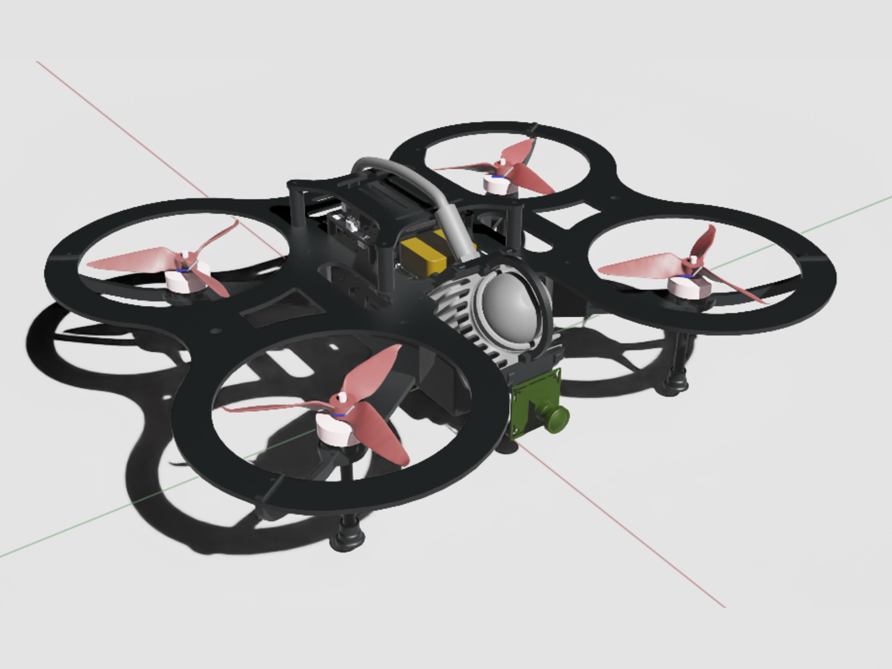

# Agipix — Bridging Simulation and Reality for Aerial Robotics

Agipix is an open hardware and software platform for agile indoor autonomy that runs the same ROS 2, containerized stack in both Isaac Sim and on the real robot. A small 438×372 mm footprint with a multi-modal sensor suite (3D LiDAR, RGB camera, IMU) and a Jetson Orin NX companion enables robust exploration and mapping with zero code changes from sim to real.

	
	

For the accompanying paper-style write-up, see `todo` (IEEE conference format). It details hardware co-design, the LiDAR–inertial–visual stack, the Isaac Sim digital twin, and sim-to-real synchronization.

## Highlights

1) Sim-to-real deployability — Identical ROS 2 containers and configs run in Isaac Sim and on hardware; zero code changes between environments.

2) Open-source hardware and software — Full BOM, CAD, simulation assets, and the containerized ROS 2 stack are released in this repo: [bom/BOM.md](bom/BOM.md), [cad/](cad/), [model_exports/](model_exports/), [doc/](doc/), [LICENSE](LICENSE).

3) ROS 2–based modular autonomy stack — Perception, state estimation, mapping, planning, PX4 interface, and logging run as decoupled nodes/containers with DDS QoS tuning.

4) Small form factor for indoor navigation — Compact 438×372 mm envelope with guards; measured thrust-to-weight ratio (TWR) ≈ 2.98:1 for precise maneuvers in tight spaces.

5) Extensive sensor system incl. 3D LiDAR — 3D LiDAR, RGB camera, and IMU integrated into a LiDAR–inertial–visual stack for robust mapping and exploration.

6) Modular hardware with expandability — Layered decks and accessible power/data breakouts simplify sensor or compute upgrades without redesign.

## Repository layout

- `doc/` — Setup and usage guides
	- `sim/setup_sim.md` — Simulation setup
	- `real/1_hardware_assembly.md` — Hardware assembly
	- `real/2_flashing_hardware.Md` — Flashing and firmware
	- `real/3_software_setup.md` — Software setup on the robot
- `bom/` — Bill of Materials
	- `BOM.md` — Human-readable BOM
	- `bom.csv` — Source BOM (CSV)
- `cad/` — Mechanical CAD (designs and fabrication)
- `model_exports/` — Exported models (STL/USD) for sim and docs
- `calibration/` — Calibration assets (real and sim)
- `_assets/` — Images, videos, and datasheets used in docs
- `todo` — IEEE-style paper source describing Agipix

## Quick start

### Simulation
- Follow the steps in [Simulation setup](doc/sim/setup_sim.md) to bring up Isaac Sim and the ROS 2 containers.

### Real hardware
- Start with [Hardware assembly](doc/real/1_hardware_assembly.md) for assembly.
- Then [Flashing and firmware](doc/real/2_flashing_hardware.Md).
- Finally [Software setup](doc/real/3_software_setup.md) to deploy the containerized stack.

## Bill of Materials (BOM)

- Browse the human-friendly BOM: [bom/BOM.md](bom/BOM.md)
- Source CSV for spreadsheets/scripts: [bom/bom.csv](bom/bom.csv)

## CAD and Simulation Assets

- Mechanical CAD and fabrication files live in `cad/`.
- Exported meshes and scene assets are in `model_exports/`.

## Paper and citation

- Main manuscript: [root.tex](root.tex) (IEEE conference format). If you use Agipix in academic work, please cite the paper once available. Until then, you may reference this repository.

## License

This project is released under the terms in [LICENSE](LICENSE).

## Acknowledgment

Agipix is supported by RAICAM, MSCA HORIZON EU.

## Contact Authors

- Sasanka Kuruppu Arachchige — sasa.kuruppuarachchi@gmail.com
- Joni Kämäräinen — joni.kamarainen@tuni.fi
