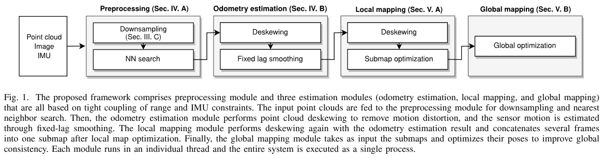
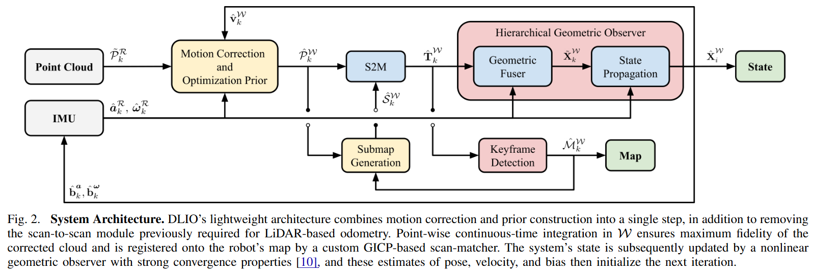

# Agipix Autonomy: Perception
[](https://opensource.org/licenses/MIT) 
[](https://releases.ubuntu.com/22.04/)
[](https://releases.ubuntu.com/22.04/)

There are currently preception algorithems validated on the platform
1. GLIM
2. DLIO

## 1. GLIM: 3D Range-Inertial Localization and Mapping with GPU-Accelerated Scan Matching Factors



GLIM is tested on Ubuntu 22.04 / 24.04 with CUDA 12.2 / 12.5 / 12.6, and NVIDIA Jetson Orin (JetPack 6.1). You can build and install GLIM from source code, or install pre-built binaries from PPA.

## Install from source

### Common dependencies

```bash
# Install dependencies
sudo apt install libomp-dev libboost-all-dev libmetis-dev \
                 libfmt-dev libspdlog-dev \
                 libglm-dev libglfw3-dev libpng-dev libjpeg-dev

# Install GTSAM
git clone https://github.com/borglab/gtsam
cd gtsam && git checkout 4.3a0
mkdir build && cd build
cmake .. -DGTSAM_BUILD_EXAMPLES_ALWAYS=OFF \
         -DGTSAM_BUILD_TESTS=OFF \
         -DGTSAM_WITH_TBB=OFF \
         -DGTSAM_USE_SYSTEM_EIGEN=ON \
         -DGTSAM_BUILD_WITH_MARCH_NATIVE=OFF
make -j$(nproc)
sudo make install

# Install Iridescence for visualization
# This is optional but highly recommended
git clone https://github.com/koide3/iridescence --recursive
mkdir iridescence/build && cd iridescence/build
cmake .. -DCMAKE_BUILD_TYPE=Release
make -j$(nproc)
sudo make install


# Install gtsam_points
git clone https://github.com/koide3/gtsam_points
mkdir gtsam_points/build && cd gtsam_points/build
cmake .. -DBUILD_WITH_CUDA=ON
make -j$(nproc)
sudo make install


# Make shared libraries visible to the system
sudo ldconfig
```

### Install GLIM for ROS2
```bash
cd ~/ros2_ws/src
git clone https://github.com/koide3/glim
git clone https://github.com/koide3/glim_ros2

cd ~/ros2_ws
colcon build

# cmake options
# colcon build --cmake-args \
#   -DBUILD_WITH_CUDA=ON \
#   -DBUILD_WITH_VIEWER=ON \
#   -DBUILD_WITH_MARCH_NATIVE=OFF
```

!!! note
    While AVX intrinsics can be enabled to speed up the mapping process by setting ```BUILD_WITH_MARCH_NATIVE=ON```, it sometimes causes segfaults unless ```march=native``` is properly set for *every* involved library. We recommend keeping it disabled if you are not sure.


## 2. Direct LiDAR-Inertial Odometry: Lightweight LIO with Continuous-Time Motion Correction

### Changelog
Below is a detailed changelog of the current working tree (branch `agipix_sim`), covering staged/unstaged changes.

**Interface additions (odom.h)**
- New diagnostics publishers: `alignment_good_pub`, `ekf_nis_pub`.
- New state for GICP health: thresholds, last alignment status, last pose covariance (ROS order), validity flag.
- EKF controls and noise settings: enable flags, use-cov flag, NIS threshold, measurement floors, continuous-time IMU noise stddevs, legacy process noise diagonals, EKF covariance `ekf_P_`, last NIS.
- EKF helper declarations: `ekfPredict`, `ekfUpdateFromLidar`.
- Option to ignore bad alignments.

**Core logic changes (odom.cc)**
- Diagnostics and publishers:
  - Publish alignment health (`alignment_good`) and EKF NIS (`ekf_nis`).
  - Optionally publish pose covariance into `nav_msgs/Odometry.pose.covariance` when available.
- Parameter loading:
  - Loads all new GICP failure, covariance publishing, bad-alignment ignore, and EKF parameters (including IMU noise and measurement floors).
- GICP alignment handling:
  - If GICP does not converge, alignment is flagged bad and diagnostics are published.
  - Hessian-based pose covariance is computed with symmetrization, damping on bad alignments, variance floor, and reordered to ROS [x y z r p y].
  - Alignment health is evaluated via condition number, min eigenvalue, fitness per point, and inlier count; failures can cause the correction to be ignored (`gicp_ignore_bad_alignment`).
- EKF integration:
  - Predict step uses continuous-time error-state linearization with IMU noise parameters; runs on IMU callbacks when enabled.
  - Update step fuses LiDAR pose with optional GICP-derived covariance plus floors, computes NIS with gating, and publishes NIS.
  - Falls back to geometric observer when EKF is disabled or an update is rejected/ignored.
- IMU handling robustness:
  - After calibration, IMU time base is reset.
  - IMU `dt` is clamped for non-monotonic/large jumps to avoid unstable propagation.
- Covariance stability:
  - Innovation covariance in the EKF update is symmetrized; update aborts if LDLT fails.
- Minor: explicit `<limits>` include.

**Behavioral impacts**
- Safer handling of bad/unstable GICP alignments to prevent corrupting state.
- Optional EKF fusion with statistical gating and measurement covariance from GICP.
- Pose covariance now available on odometry messages when enabled.
- IMU time/`dt` robustness reduces risk of large integration spikes.




#### [[ IEEE ICRA ](https://ieeexplore.ieee.org/document/10160508)] [[ arXiv ](https://arxiv.org/abs/2203.03749)] [[ Video ](https://www.youtube.com/watch?v=4-oXjG8ow10)] [[ Presentation ](https://www.youtube.com/watch?v=Hmiw66KZ1tU)]

DLIO is a new lightweight LiDAR-inertial odometry algorithm with a novel coarse-to-fine approach in constructing continuous-time trajectories for precise motion correction. It features several algorithmic improvements over its predecessor, [DLO](https://github.com/vectr-ucla/direct_lidar_odometry), and was presented at the IEEE International Conference on Robotics and Automation (ICRA) in London, UK in 2023.

<br>
<p align='center'>
    
</p>

### Instructions

#### Sensor Setup
DLIO has been extensively tested using a variety of sensor configurations and currently supports Ouster, Velodyne, and Hesai LiDARs. The point cloud should be of input type `sensor_msgs::PointCloud2` and the 6-axis IMU input type of `sensor_msgs::Imu`.

For best performance, extrinsic calibration between the LiDAR/IMU sensors and the robot's center-of-gravity should be inputted into `cfg/dlio.yaml`. If the exact values of these are unavailable, a rough LiDAR-to-IMU extrinsics can also be used (note however that performance will be degraded).

IMU intrinsics are also necessary for best performance, and there are several open-source calibration tools to get these values. These values should also go into `cfg/dlio.yaml`. In practice however, if you are just testing this work, using the default ideal values and performing the initial calibration procedure should be fine.

Also note that the LiDAR and IMU sensors _need_ to be properly time-synchronized, otherwise DLIO will not work. We recommend using a LiDAR with an integrated IMU (such as an Ouster) for simplicity of extrinsics and synchronization.

#### Dependencies
The following has been verified to be compatible, although other configurations may work too:

- Ubuntu 22.04
- ROS Humble (`rclcpp`, `std_msgs`, `sensor_msgs`, `geometry_msgs`, `nav_msgs`, `pcl_ros`)
- C++ 14
- CMake >= `3.12.4`
- OpenMP >= `4.5`
- Point Cloud Library >= `1.10.0`
- Eigen >= `3.3.7`

```sh
sudo apt install libomp-dev libpcl-dev libeigen3-dev
```

DLIO currently supports `ROS 1` and `ROS 2`!

#### Compiling
Compile using the [`catkin_tools`](https://catkin-tools.readthedocs.io/en/latest/) package via:

```sh
mkdir ~/ros2_ws && cd ~/ros2_ws && mkdir src && cd src
```
```sh
git clone https://github.com/vectr-ucla/direct_lidar_inertial_odometry -b feature/ros2
```
```sh
cd ~/ros2_ws
```
```sh
colcon build --symlink-install --packages-select direct_lidar_inertial_odometry
```

#### Execution

<details>
<summary> After compiling, don't forget to source before ROS commands.</summary>

``` bash
source ~/ros2_ws/install/setup.bash
```
</details>

Execute via:

```sh
roslaunch direct_lidar_inertial_odometry dlio.launch \
  rviz:={true, false} \
  pointcloud_topic:=/robot/lidar \
  imu_topic:=/robot/imu
```

<details>
<summary> Example command: </summary>

``` bash
ros2 launch direct_lidar_inertial_odometry dlio.launch.py rviz:=true pointcloud_topic:=/lexus3/os_center/points imu_topic:=/lexus3/os_center/imu
```
</details>

Be sure to change the topic names to your corresponding topics. Alternatively, edit the launch file directly if desired. If successful, you should see the following output in your terminal:
<br>
<p align='center'>
    
</p>

#### Services
To save DLIO's generated map into `.pcd` format, call the following service:

```sh
ros2 service call /save_pcd direct_lidar_inertial_odometry/srv/SavePCD "{'leaf_size': 0.2, 'save_path': '~/map'}"
```

#### Test Data
For your convenience, we provide test data [here](https://drive.google.com/file/d/1Sp_Mph4rekXKY2euxYxv6SD6WIzB-wVU/view?usp=sharing) (1.2GB, 1m 13s, Ouster OS1-32) of an aggressive motion to test our motion correction scheme, and [here](https://drive.google.com/file/d/1HbmF5gTHxCAMqBkEd5PTxDNQvcI8tKXn/view?usp=sharing) (16.5GB, 4m 21s, Ouster OSDome) of a longer trajectory outside with lots of trees. Try these two datasets with both deskewing on and off!

<br>
<p align='center'>
    
</p>

**Run runtime Tests**
- Build with symbols: `colcon build --symlink-install --packages-select direct_lidar_inertial_odometry --cmake-args -DCMAKE_BUILD_TYPE=RelWithDebInfo`
- Source the workspace: `source ~/ros2_ws/install/setup.bash`
- Run the launch under gdb (no breakpoints yet):  
  ```bash
  ros2 launch direct_lidar_inertial_odometry dlio.launch.py --launch-prefix 'gdb -ex run --args'
  ```
  - You’ll drop into gdb; use `run` (auto-issued), then `bt` on crash. Quit with `quit`.
- To start stopped at `main` instead of auto-run:  
  ```bash
  ros2 launch direct_lidar_inertial_odometry dlio.launch.py --launch-prefix 'gdb --args'
  ```
  Then inside gdb: `start`, `break <symbol>`, `continue`.
- Handy gdb extras: `set pagination off`, `set print pretty on`, `layout split` (TUI). Add them via `-ex "cmd"`:  
  ```bash
  ros2 launch direct_lidar_inertial_odometry dlio.launch.py \
    --launch-prefix 'gdb -ex "set pagination off" -ex "set print pretty on" --args'
  ```
- If you prefer to attach instead: start normally, find PID (`ps -C dlio_odom_node -o pid,cmd`), then `gdb -p <pid>`.

## Citation
If you found this work useful, please cite our manuscript:

```bibtex
@article{chen2022dlio,
  title={Direct LiDAR-Inertial Odometry: Lightweight LIO with Continuous-Time Motion Correction},
  author={Chen, Kenny and Nemiroff, Ryan and Lopez, Brett T},
  journal={2023 IEEE International Conference on Robotics and Automation (ICRA)},
  year={2023},
  pages={3983-3989},
  doi={10.1109/ICRA48891.2023.10160508}
}
```

#### Acknowledgements

We thank the authors of the [FastGICP](https://github.com/SMRT-AIST/fast_gicp) and [NanoFLANN](https://github.com/jlblancoc/nanoflann) open-source packages:

- Kenji Koide, Masashi Yokozuka, Shuji Oishi, and Atsuhiko Banno, “Voxelized GICP for Fast and Accurate 3D Point Cloud Registration,” in _IEEE International Conference on Robotics and Automation (ICRA)_, IEEE, 2021, pp. 11 054–11 059.
- Jose Luis Blanco and Pranjal Kumar Rai, “NanoFLANN: a C++ Header-Only Fork of FLANN, A Library for Nearest Neighbor (NN) with KD-Trees,” https://github.com/jlblancoc/nanoflann, 2014.

We would also like to thank Helene Levy and David Thorne for their help with data collection.

#### License
This work is licensed under the terms of the MIT license.
