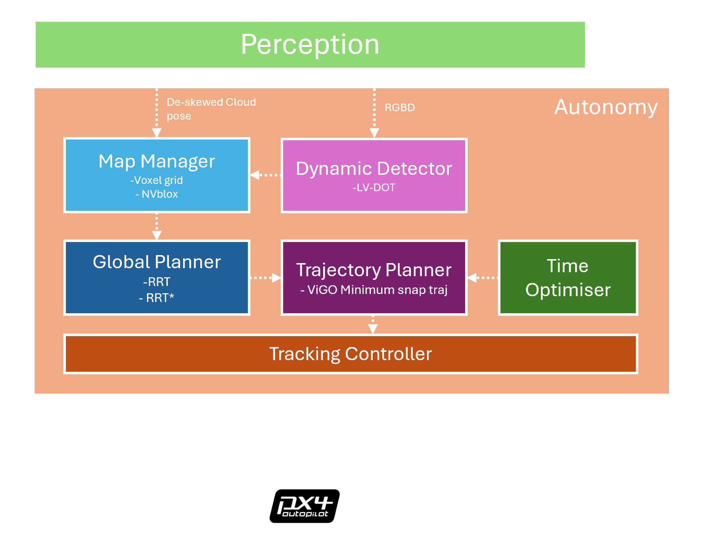

# Agipix Autonomy: Planning and Control
[](https://opensource.org/licenses/MIT) 
[](https://releases.ubuntu.com/20.04/)
[](https://releases.ubuntu.com/20.04/)




## AgiAUTO (ROS 2) — Agipix PX4 Autonomy Stack

This repository is the **AgiAUTO** autonomy module of **Agipix** for PX4-based UAV missions in ROS 2.

- HW and SIM Platform Repository: https://github.com/SasaKuruppuarachchi/agipix.git
- Platform docs: https://sasakuruppuarachchi.github.io/agipix/
- Publication (ICUAS 2026 submission): *"Agipix: A Comprehensive Aerial Robotics Platform Bridging Simulation and Reality"*

---

## System architecture (current)

```text
									Sensors 
						(depth / point cloud / RGB / lidar) 
								+ PX4 state topics
										│
										▼
								onboard_detector
					(dynamic obstacle detection + tracking)
										│
										▼
									map_manager 
					(occupancy/dynamic map + collision/raycast)
										│
					┌───────────────────┴──────────────────────────┐
					▼                                              ▼
			global_planner (RRT/RRT*/DEP)                    trajectory_planner
		(global waypoints / exploration path) 	            (poly/PWL/B-spline)
					└───────────────────┬──────────────────────────┘
										▼
							 	 time_optimizer 
								   (optional)
								        │
										▼
								autonomous_flight 
						(mission executive/state machine)
										│
										▼
							  px4_control_interface 
				(DDS tracking mode + setpoint writer + executor flow)
										▼
  									   PX4
```

---

## Package roles

- `autonomous_flight`: mission orchestration (`takeoff`, `navigation`, `rl_navigation`, `dynamic_navigation`, `inspection`, `dynamic_inspection`, `dynamic_exploration`)
- `px4_control_interface`: DDS-native PX4 mode/executor runtime and target tracking bridge
- `map_manager`: occupancy and dynamic map representations, map services
- `onboard_detector`: dynamic obstacle perception, data association, tracking
- `global_planner`: global planning and exploration planning (RRT/RRT*, DEP)
- `trajectory_planner`: smooth local trajectory generation (poly/PWL/B-spline)
- `time_optimizer`: trajectory time allocation optimization utilities
- `agi_viz`: centralized RViz profiles for autonomy stack visualization

> Note: the standalone legacy middle-level controller package is no longer part of the active DDS runtime control path.

---

## PX4 ROS 2 interface setup

Validated against **PX4 v1.16.1** message definitions.

```bash
mkdir -p ~/workspace/agipix_control/src
cd ~/workspace/agipix_control/src

# PX4 messages + autopilot source (for message sync)
git clone https://github.com/PX4/px4_msgs.git
git clone https://github.com/PX4/PX4-Autopilot.git -b v1.16.1

# Sync message/service definitions
rm -f px4_msgs/msg/*.msg px4_msgs/srv/*.srv
cp PX4-Autopilot/msg/*.msg px4_msgs/msg/
cp PX4-Autopilot/msg/versioned/*.msg px4_msgs/msg/
cp PX4-Autopilot/srv/*.srv px4_msgs/srv/
touch px4_version_synced_v1_16_1
rm -rf PX4-Autopilot

# PX4 ROS 2 interface library
git clone https://github.com/Auterion/px4-ros2-interface-lib -b release/1.16
```

Compatibility check:

```bash
cd ~/workspace/agipix_control/src/px4-ros2-interface-lib
./scripts/check-message-compatibility.py -v path/to/px4_msgs/ path/to/PX4-Autopilot/
```

Build:

```bash
cd ~/workspace/agipix_control
colcon build --packages-select px4_msgs
colcon build --packages-select px4_ros2_cpp
colcon build # builds the autonomy stack
```

---

## Demo media (placeholders)

```bash
ros2 launch px4_control_interface dds_shadow.launch.py use_sim_time:=true start_legacy_stack:=true mission:=<mission_name>
```

Available missions: 
`takeoff_and_hover`, `takeoff_and_track_circle`, `navigation`, `rl_navigation`, `dynamic_navigation`, `dynamic_inspection`, `dynamic_exploration`, `inspection`

- [PLACEHOLDER] Takeoff + hover demo video
- [PLACEHOLDER] Dynamic navigation demo video
- [PLACEHOLDER] Dynamic exploration demo video
- [PLACEHOLDER] Dynamic inspection demo video

---

## Current status

- ROS 1 → ROS 2 porting completed for the autonomy stack in this repository.
- Runtime stack is **PX4 DDS-native** (MAVROS backend removed from active control path).
- Mission validation status:
	- ✅ takeoff and hover
	- ✅ takeoff and track circle
	- ✅ navigation
	- ✅ rl navigation
	- ✅ dynamic navigation
	- ✅ dynamic exploration
	- ✅ dynamic inspection

---

## Credits

This stack builds on original CERLAB autonomy components and research implementations by **Zhefan Xu** and collaborators.

This repository version is a ROS 2 integration within Agipix by **Sasa Kuruppuarachchi**.

Please credit both:

1. Original algorithm/software authors (see package-level citations)
2. Agipix ROS 2 integration and platform engineering work in this repository