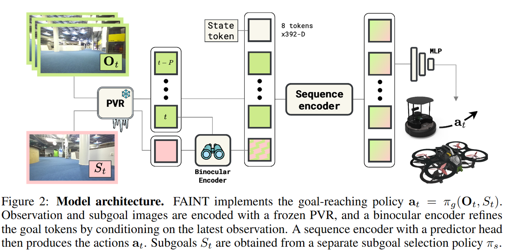

# Agipix Autonomy: Planning and Control
 

The Robot Navigates to given subgoals using the end to end model. By leveraging pretrained visual representations, the proposed policy achieves up to 50% higher navigation success and generalizes across ground and aerial robots.

 

	<iframe
		src="https://www.youtube.com/embed/izExoAxZoeo"
		title="YouTube video player"
		frameborder="0"
		allow="accelerometer; autoplay; clipboard-write; encrypted-media; gyroscope; picture-in-picture; web-share"
		allowfullscreen
	></iframe>
	
Agipix running FAINT - CoRL 25

	<!-- To change the video, replace EMFauA1CU8M with the new YouTube ID. -->
	<!-- If you prefer privacy-enhanced mode, use: https://www.youtube-nocookie.com/embed/VIDEO_ID -->

