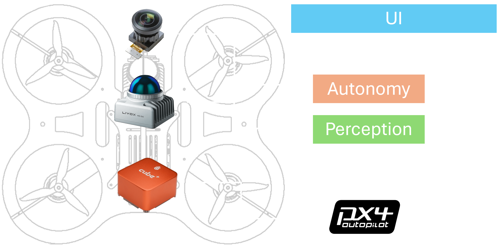

# Agipix (Autonomy) — Quick Guide

Use this page to jump into the autonomy stack. It stays brief and links to the full guides.

## Perception

- ROS 2 Humble packages for sensing and environment understanding.
- Typical inputs: LiDAR and/or RGB‑D; relies on odometry/pose from SLAM/VIO.
- Outputs feed mapping and planning (detections, depth/point clouds, occupancy/map layers).
- Runs on Linux x86_64 and ARM (Jetson) per the module badges.

## Planning & Control

- Modular ROS 2 stack: mapping, global/trajectory planning, tracking controller, and mission wrappers.
- Supports tasks like autonomous navigation, exploration, and inspection.
- Built with colcon; typically used with Docker + Isaac ROS runtime.
- Demos mirror between simulation and PX4/real flight for behavior parity.

## Data‑Driven Autonomy

- End‑to‑end policy that navigates via sub‑goals using learned visual representations.
- Leverages pretrained features; reports up to ~50% higher navigation success.
- Generalizes across ground and aerial robots.
- See the page for the illustrative figure and demo video.

## Next steps
- If you haven’t set up the runtime yet, see real robot [Software Setup](../real/3_software_setup.md).
- To run in simulator first: go to simulation [Quick Guide](../sim/index.md).
- Coming from hardware bring-up? Start at real robot [Quick Guide](../real/index.md).