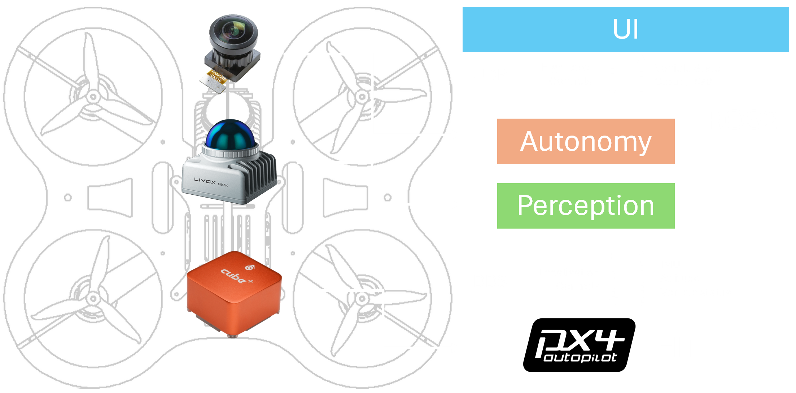

# Agipix (Autonomy) — Quick Guide

Use this page to navigate the AgiAUTO stack used identically in simulation and real flights.

## Perception

- LiDAR-inertial state estimation and mapping for GPS-denied indoor operation.
- Dynamic obstacle handling and occupancy map generation for planning.
- Designed for robust indoor inspection with onboard sensing.

Read: [Perception](./1_perception.md)

## Planning & Control

- Local planner for dynamically feasible trajectories in clutter.
- On-manifold MPC tracking with PX4 setpoint streaming.
- Supports teleop, goal, navigation, and exploration control modes.

Read: [Planning & Control](./2_planning_control.md)

## Data‑Driven Autonomy

- Integration path for learned navigation policies with zero-shot transfer tests.
- Includes deployment notes and experimental examples.

Read: [Learning-Based Planning & Control](./3_planning_control_data.md)

## Next steps
- If runtime is not ready yet, start with [Real Docker Build](../real/3_docker_build.Md)
- To test in simulation first: [Simulation Quick Guide](../sim/index.md)
- For operator workflows: [UI Quick Guide](../ui/index.md)