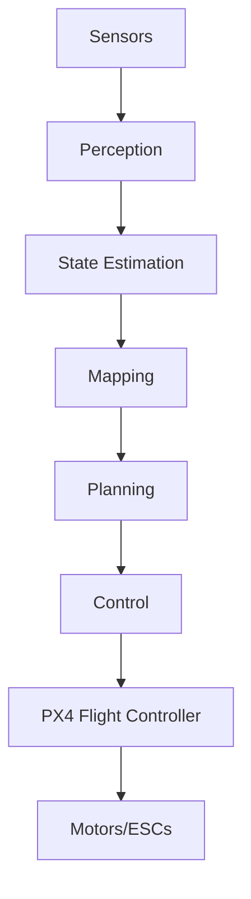

# Overview

Agipix is an open hardware and software platform designed for agile indoor autonomy. It bridges the gap between simulation and reality by running the same ROS 2 containerized stack in both Isaac Sim and on real hardware.

## What is Agipix?

Agipix is a comprehensive aerial robotics platform that includes:

- **Hardware Platform**: A compact quadrotor with a 438×372 mm footprint
- **Sensor Suite**: 3D LiDAR (Livox Mid-360), RGB camera, IMU
- **Compute Platform**: Jetson Orin NX with Hadron carrier board
- **Software Stack**: Modular ROS 2 nodes for perception, mapping, planning, and control
- **Simulation Environment**: Full digital twin in NVIDIA Isaac Sim

## Key Benefits

### Sim-to-Real Deployability

One of Agipix's most powerful features is its sim-to-real capability. The exact same containerized ROS 2 stack runs in both simulation and on hardware with **zero code changes**. This dramatically accelerates development and testing cycles.

### Open Source

Everything you need to build and deploy Agipix is open source:

- Complete Bill of Materials (BOM)
- CAD files for mechanical design
- Simulation assets (USD, STL meshes)
- ROS 2 source code and configurations
- Documentation and setup guides

### Modular Design

The autonomy stack is highly modular:

- **Perception**: Sensor data processing and feature extraction
- **State Estimation**: Sensor fusion for localization
- **Mapping**: 3D environment reconstruction
- **Planning**: Path and trajectory planning
- **Control**: PX4 interface for low-level control
- **Logging**: Data recording and playback

Each module runs as a separate ROS 2 node/container, enabling easy customization and replacement.

### Small Form Factor

With a compact footprint of 438×372 mm and a thrust-to-weight ratio of approximately 2.98:1, Agipix is designed for agile maneuvers in tight indoor spaces.

## System Architecture

## Use Cases

Agipix is suitable for various indoor autonomy applications:

- **Research**: Academic research in aerial robotics and autonomy
- **Education**: Teaching robotics and autonomous systems
- **Development**: Rapid prototyping of autonomy algorithms
- **Indoor Inspection**: Autonomous inspection in confined spaces
- **Exploration**: Unknown environment exploration and mapping

## Next Steps

Ready to get started? Check out the [Quick Start Guide](quick-start.md) to begin your journey with Agipix.
