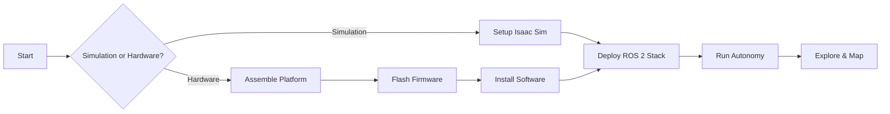

# Quick Start Guide

This guide will help you get started with Agipix quickly, whether you want to work in simulation or with real hardware.

## Prerequisites

Before you begin, ensure you have:

- A Linux workstation running Ubuntu 22.04
- For simulation: NVIDIA GPU with recent drivers
- For hardware: The components listed in the [Bill of Materials](../bom/bom.md)

## Choose Your Path

### Path 1: Simulation First (Recommended)

Starting with simulation is the fastest way to familiarize yourself with Agipix without needing physical hardware.

**Step 1: Set up your development environment**

- Install Ubuntu 22.04
- Install ROS 2 Humble
- Install NVIDIA Isaac Sim

**Step 2: Follow the simulation setup guide**

[:octicons-arrow-right-24: Go to Simulation Setup](../simulation/setup.md)

**Step 3: Run your first simulation**

Once setup is complete, you'll be able to:

- Launch Isaac Sim with the Agipix digital twin
- Run the autonomy stack
- Test navigation and exploration algorithms

### Path 2: Build Real Hardware

If you want to build the physical platform, follow these steps in order:

**Step 1: Gather materials**

[:octicons-arrow-right-24: View Bill of Materials](../bom/bom.md)

**Step 2: Assemble hardware**

[:octicons-arrow-right-24: Hardware Assembly Guide](../hardware/assembly.md)

**Step 3: Flash firmware**

[:octicons-arrow-right-24: Flashing Firmware Guide](../hardware/flashing.md)

**Step 4: Set up software**

[:octicons-arrow-right-24: Software Setup Guide](../hardware/software-setup.md)

**Step 5: Deploy autonomy stack**

[:octicons-arrow-right-24: Autonomy Stack Overview](../autonomy/overview.md)

## Workflow Overview



## Common Tasks

### Running a Simulation

```bash
# Start Isaac Sim with Agipix scene
./isaac-sim.sh

# In a new terminal, launch ROS 2 nodes
ros2 launch agipix_bringup sim.launch.py
```

### Connecting to Hardware

```bash
# SSH into Jetson Orin NX
ssh agipix@192.168.1.100

# Launch hardware nodes
ros2 launch agipix_bringup hardware.launch.py
```

### Testing Autonomy

```bash
# Launch autonomy stack
ros2 launch agipix_autonomy exploration.launch.py

# Send exploration command
ros2 service call /start_exploration std_srvs/srv/Trigger
```

## Getting Help

If you encounter issues:

1. Check the detailed documentation for your specific component
2. Review the [GitHub Issues](https://github.com/SasaKuruppuarachchi/agipix/issues)
3. Contact the maintainers (see [Contact](../about/contact.md))

## What's Next?

After completing the quick start:

- Explore the [Autonomy Stack](../autonomy/overview.md) in detail
- Learn about [Customization and Extension](#)
- Run advanced scenarios and experiments

!!! tip "Pro Tip"
    We recommend starting with simulation even if you plan to use hardware. This lets you understand the software stack before dealing with hardware challenges.
