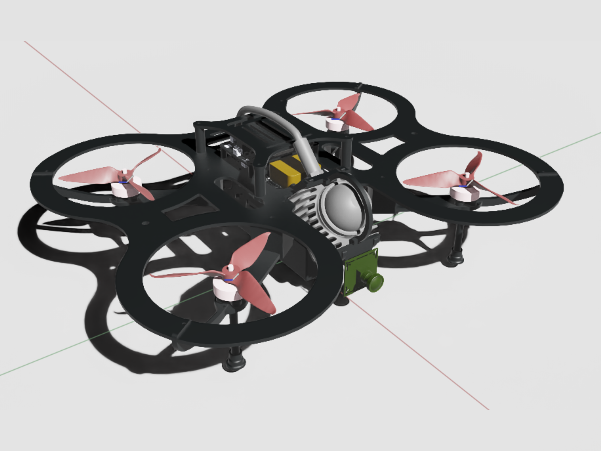

# Agipix — Bridging Simulation and Reality for Aerial Robotics

Agipix is an open hardware and software platform for agile indoor autonomy that runs the same ROS 2, containerized stack in both Isaac Sim and on the real robot. A small 438×372 mm footprint with a multi-modal sensor suite (3D LiDAR, RGB camera, IMU) and a Jetson Orin NX companion enables robust exploration and mapping with zero code changes from sim to real.

    
    

## Highlights

1. **Sim-to-real deployability** — Identical ROS 2 containers and configs run in Isaac Sim and on hardware; zero code changes between environments.

2. **Open-source hardware and software** — Full BOM, CAD, simulation assets, and the containerized ROS 2 stack are released in this repository.

3. **ROS 2–based modular autonomy stack** — Perception, state estimation, mapping, planning, PX4 interface, and logging run as decoupled nodes/containers with DDS QoS tuning.

4. **Small form factor for indoor navigation** — Compact 438×372 mm envelope with guards; measured thrust-to-weight ratio (TWR) ≈ 2.98:1 for precise maneuvers in tight spaces.

5. **Extensive sensor system incl. 3D LiDAR** — 3D LiDAR, RGB camera, and IMU integrated into a LiDAR–inertial–visual stack for robust mapping and exploration.

6. **Modular hardware with expandability** — Layered decks and accessible power/data breakouts simplify sensor or compute upgrades without redesign.

## Repository Layout

- **doc/** — Setup and usage guides
    - **sim/setup_sim.md** — Simulation setup
    - **real/1_hardware_assembly.md** — Hardware assembly
    - **real/2_flashing_hardware.Md** — Flashing and firmware
    - **real/3_software_setup.md** — Software setup on the robot
- **bom/** — Bill of Materials
    - **BOM.md** — Human-readable BOM
    - **bom.csv** — Source BOM (CSV)
- **cad/** — Mechanical CAD (designs and fabrication)
- **model_exports/** — Exported models (STL/USD) for sim and docs
- **calibration/** — Calibration assets (real and sim)
- **_assets/** — Images, videos, and datasheets used in docs

## Quick Navigation

-   :rocket:{ .lg .middle } __Getting Started__

    ---

    Learn how to set up Agipix in simulation or with real hardware

    [:octicons-arrow-right-24: Quick Start Guide](getting-started/quick-start.md)

-   :material-cube-outline:{ .lg .middle } __Simulation__

    ---

    Set up Isaac Sim and the ROS 2 containers for testing in simulation

    [:octicons-arrow-right-24: Simulation Setup](simulation/setup.md)

-   :material-robot:{ .lg .middle } __Hardware__

    ---

    Build the physical platform from assembly to firmware flashing

    [:octicons-arrow-right-24: Hardware Assembly](hardware/assembly.md)

-   :material-brain:{ .lg .middle } __Autonomy Stack__

    ---

    Explore the modular ROS 2 autonomy framework

    [:octicons-arrow-right-24: Autonomy Overview](autonomy/overview.md)

## Features at a Glance

| Feature | Description |
|---------|-------------|
| **Platform** | Open-source hardware and software |
| **Size** | Compact 438×372 mm footprint |
| **Sensors** | 3D LiDAR, RGB camera, IMU |
| **Compute** | Jetson Orin NX on Hadron carrier |
| **Software** | ROS 2 Humble, containerized stack |
| **Sim-to-Real** | Zero code changes from Isaac Sim to hardware |
| **TWR** | ~2.98:1 for agile indoor maneuvers |

## Project Support

Agipix is supported by **RAICAM, MSCA HORIZON EU**.

## License

This project is released under the terms in the [LICENSE](about/license.md).
