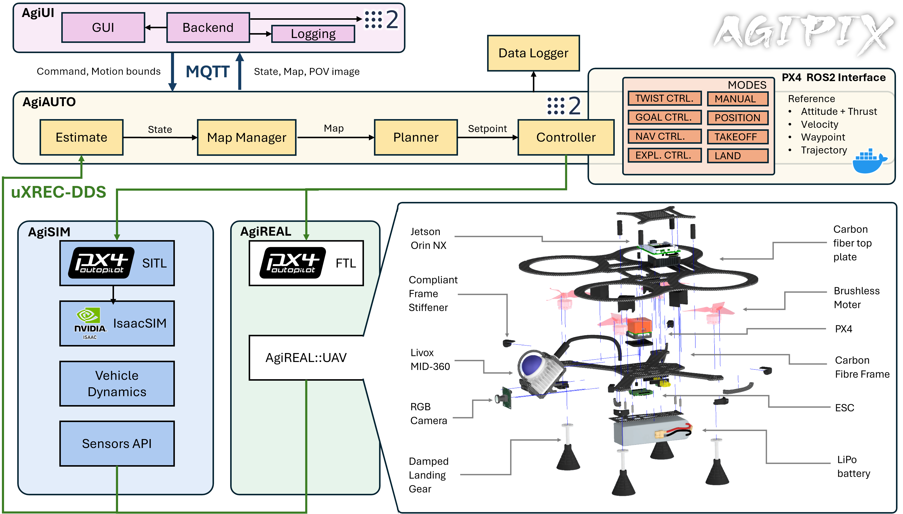

# Documentation Hub

Agipix documentation is organized around the four platform blocks from the paper: real hardware, simulation, autonomy, and operator UI.

Pick a scope to dive into. Each scoped section includes a sidebar with step-by-step pages.

	

		<h3>Real Hardware</h3>
		
Build, wire, flash, and validate the physical platform.

		<ul>
			<li>Assembly and wiring</li>
			<li>Flashing Jetson & carrier</li>
			<li>Container and software setup</li>
		</ul>
		
<a class="btn" href="{{ '/docs/real/' | relative_url }}">Real Docs →</a>

	

	

		<h3>Simulation</h3>
		
Use the digital twin in Isaac Sim before hardware deployment.

		<ul>
			<li>Isaac Sim environment</li>
			<li>Containerized workflow</li>
			<li>PX4 SITL + ROS 2 bridge</li>
		</ul>
		
<a class="btn" href="{{ '/docs/sim/' | relative_url }}">Sim Docs →</a>

	

	

		<h3>Autonomy</h3>
		
Perception, planning/control, and learning-based navigation.

		<ul>
			<li>Perception pipeline</li>
			<li>Planning and control</li>
			<li>Data-driven policy integration</li>
		</ul>
		
<a class="btn" href="{{ '/docs/autonomy/' | relative_url }}">Autonomy Docs →</a>

	

	

		<h3>User Interface</h3>
		
Mission supervision, teleoperation, and human-in-the-loop workflows.

		<ul>
			<li>Teleoperation</li>
			<li>Exploration mode control</li>
			<li>Human-in-the-loop control</li>
		</ul>
		
<a class="btn" href="{{ '/docs/ui/' | relative_url }}">UI Docs →</a>

	

