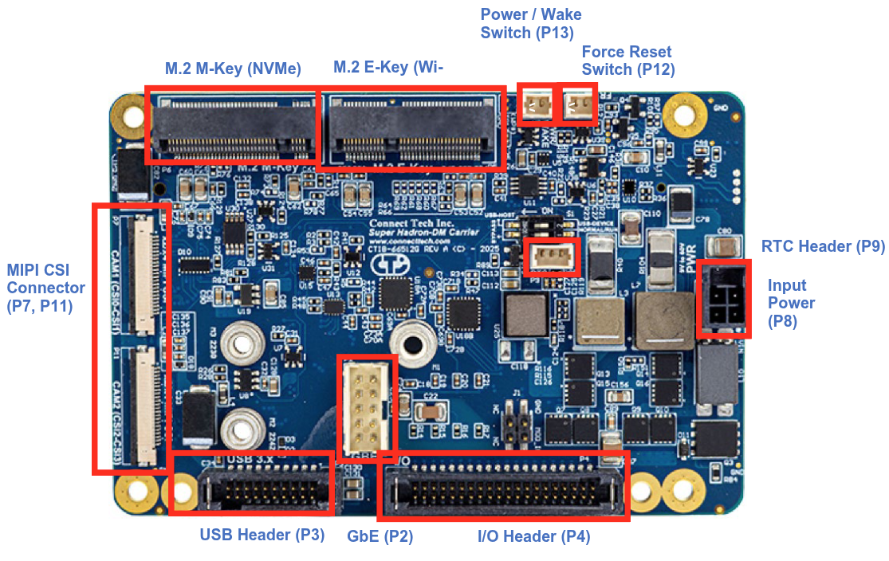

# Flashing the NVIDIA Jetson (JetPack 6.x)

Refer to the [Datasheets](../../assets/datasheets/CTIM-00088.pdf) and install the Jetson Orin NX module, wiring and power to the Hadron carrier. 
Refer the [Official Page](https://connecttech.com/product/hadron-carrier-for-nvidia-jetson-orin-nx/) For the download of the latest official BSP (Board Support Package) and release notes which contains the firmware install instructions.

> Note: These steps target Jetson Orin NX/Nano on Connect Tech carriers (Hadron, etc.), Jetson Linux R36.3. Adjust versions as needed. 
**Tested for CT Hadron NGX027 with the Jetpack 6.2.1 - L4T r36.4.4 (BSP Version: ORIN-NX-NANO-36.4.4 V002)**

Prerequisities:
- x86/x64 based host machine running Ubuntu 20.04 or 22.04
- JetPack 6.2.1 / L4T 36.4.4 installed (Intstructions follows)
- Orin™ NX or Orin™ NX module
- Connect Tech Orin™ NX/Orin™ NX Carrier
- USB A - USB A Cable for flashing

## Install Wifi and SSD

Install the [wifi](https://www.intel.com/content/www/us/en/products/sku/230078/intel-wifi-7-be200/specifications.html) and [ssd](https://www.verkkokauppa.com/fi/product/906691/WD-Black-SN770M-1-Tt-M-2-NVMe-SSD-kovalevy) cards to the PCI mini E and M slots respectively.

## Powering up the carrier
The 6S Lipo can be used to power up the board directly. Install a 60V capacitor between the terminals of the main power.
Alternatively a AC DC adapter with min 40 W (10-60V) can be used.
 Get the board ready to be powered up for he flashing of firmware.



## What you’ll do
- Prepare a host machine and download JetPack BSP + sample rootfs
- Install the CTI BSP on the host
- Put the Jetson in recovery mode and flash (auto or manual)
- Perform first boot steps and basic post-setup

---

## 1) Get JetPack (Driver Package + RootFS)

1) Create a working directory, referred to as BSP_ROOT below.

2) Open the Jetson Linux R36.4.4 downloads and notes:
   - Driver page: https://developer.nvidia.com/embedded/jetson-linux-r3644

3) Download both for Orin (LT4):
   - Driver Package (BSP): Jetson_Linux_R36.4.4_aarch64.tbz2
   - Sample Root Filesystem: Tegra_Linux_Sample-Root-Filesystem_R36.4.4_aarch64.tbz2

4) Place both files under BSP_ROOT, then extract them:

```bash
cd <BSP_ROOT>
sudo tar -jxf Jetson_Linux_R36.4.4_aarch64.tbz2
sudo tar -C Linux_for_Tegra/rootfs/ -xjf Tegra_Linux_Sample-Root-Filesystem_R36.4.4_aarch64.tbz2
```

After extraction, you should have `<BSP_ROOT>/Linux_for_Tegra` populated.

---

## 2) Install the CTI BSP

If you used NVIDIA SDK Manager, BSP_ROOT is typically:
- `~/nvidia/nvidia_sdk/<JetPack_Version>_Linux_JETSON_NX_ORIN_TARGETS/`
- or `~/nvidia/nvidia_sdk/<JetPack_Version>_Linux_JETSON_NANO_ORIN_TARGETS/`

If you manually downloaded from the Embedded Download Center, use the folder you created as BSP_ROOT.

1) Copy the CTI package to Linux_for_Tegra:

```bash
cp CTI-L4T-ORIN-NX-NANO-36.4.4-V002.tgz BSP_ROOT/Linux_for_Tegra
```

2) Extract it and run the installer:

```bash
cd <BSP_ROOT>/Linux_for_Tegra
sudo tar -xzf CTI-L4T-ORIN-NX-NANO-36.4.4-V002.tgz
cd CTI-L4T
sudo ./install.sh
cd .. # back to Linux_for_Tegra
```

> The CTI-L4T BSP is now installed on the host, and you can flash Orin NX/Nano.

---

## 3) Put the device in Recovery Mode

1) Connect the carrier to your host via USB per the carrier manual.
2) Ensure an NVMe M.2 SSD is installed.
3) Follow the carrier instructions to enter recovery (button/strap sequence).

> Tip: You can verify via `lsusb` for an NVIDIA device in recovery.
```shell
Bus 001 Device 024: ID 0955:7323 NVIDIA Corp. APX
```

---

## 4) Flashing options

You can use either the CTI automated script or the manual NVMe flash script.

### Option A: Automated (menu-driven)

```bash
cd <BSP_ROOT>/Linux_for_Tegra
sudo ./cti-flash.sh
```
Follow the menu to select your module and board configuration. Flashing will begin.

### Option B: Manual NVMe flash

Do not include the `.conf` extension in `<config>`.

```bash
cd <BSP_ROOT>/Linux_for_Tegra
sudo ./cti-nvme-flash.sh cti/<module>/<boardname>/<config>
# <module> is one of: orin-nx | orin-nano
```
Examples:
```bash
./cti-nvme-flash.sh cti/orin-nx/boson/base
./cti-nvme-flash.sh cti/orin-nano/boson/base
SUPER_MODE=1 ./cti-nvme-flash.sh cti/orin-nx/hadron/base
```

When flashing completes, the device will reboot.
```bash
Flash is successful
Reboot device
Cleaning up...
Log is saved to
```
---

### 5.1) Troubleshoot Flashing
#### ISSUE1 : A USB timeout error may occur during flashing. The following error indicates that your flash host’s USB port is not enabled:

```bash
[ 0.1172 ] Sending bct_br
[ 0.1603 ] ERROR: might be timeout in USB write.
Error: Return value
```
##### 1. First try changing the USB port:

- Move to a different USB port, if available.

- **Remove any USB-C docks if connected**

- Power cycle the board and retry flashing.

##### 2. If that doesn’t work, try disabling autosuspend:

To disable autosuspend on your host’s USB ports, run the following command.
```bash
sudo bash -c 'echo -1 > /sys/module/usbcore/parameters/autosuspend'
```
Power cycle the board and retry flashing.

#### ISSUE2 : Cnnot mount the NFS server

```bash
12:52:45.297 - Error: Flash failure. 
12:52:45.300 - Error: Either the device cannot mount the NFS server on the host or a flash command has failed. Check your network setting (VPN, firewall,...) to make sure the device can mount NFS server. Debug log saved to /tmp/tmp.2HZma7rFSi. You can access the target's terminal through "sshpass -p root ssh root@fc00:1:1:0::2"
```

##### 1. Disable VPN completely

CTI initrd flashing fails 100% if a VPN is on.

##### 2. Restart NFS and RPC services
```bash
sudo systemctl stop rpcbind rpcbind.socket nfs-kernel-server
sudo systemctl start rpcbind rpcbind.socket nfs-kernel-server
```

Check status:

```bash
systemctl status nfs-kernel-server
```
##### 3. Ensure firewall isn't blocking NFS (especially IPv6)

Temporarily disable ufw (if running):

```bash
sudo ufw disable
```
## 5) First boot and basic setup

### Connect via serial console (recommended)
- Guide: https://jetsonhacks.com/2019/04/19/jetson-nano-serial-console/
- Complete the initial setup prompts. You can skip network here and do it below.
```bash
System Configuration
           ┌────┤ License For Customer Use of NVIDIA Software ├─────┐
           │                                                        │
           │ Welcome to Jetson Initial Configuration                │
           │                                                        │
           │                         <Ok>                           │
           │                                                        │
           └────────────────────────────────────────────────────────┘
```

### Join Wi‑Fi via nmcli
```bash
nmcli dev wifi rescan
nmcli d wifi connect <SSID> password <PASSWORD>
```

### SSH in
```bash
ssh <user>@<device-ip>
```

---

## 6) Useful post-setup

### Increase Swap 
You may need to increase swap depending on he RAM of your Jetson module
Follow [This Guide](https://www.forecr.io/blogs/programming/how-to-increase-swap-space-on-jetson-modules?srsltid=AfmBOoqQdjadGieWKvqNFyLf5XFb0XoVjQ_sH9gjZORudTmtEU1wo2yX) to upgrade swap memeory.

### NoMachine (remote desktop)
To setup remote desktop to the headless system for debugging follow [this guide](https://kb.nomachine.com/AR02R01074)

```bash
wget https://web9001.nomachine.com/download/9.2/Arm/
sudo dpkg -i nomachine_9.2.18_3_arm64.deb 
sudo systemctl disable gdm3 --now
sudo /usr/NX/bin/nxserver --restart
```

### Change power mode
```bash
sudo nvpmodel -m <mode-number>
```
- Reference: https://forums.developer.nvidia.com/t/power-mode-in-terminal/287224

### Install Docker + NVIDIA Container Toolkit + Git LFS
- Docker: https://docs.docker.com/engine/install/ubuntu/
- NVIDIA Container Toolkit: https://docs.nvidia.com/datacenter/cloud-native/container-toolkit/latest/install-guide.html
- Git LFS: https://git-lfs.com/

### Install VSCode
```bash
git clone https://github.com/JetsonHacksNano/installVSCode.git
cd installVSCode
./installVSCodeWithPython.sh
```
### Fix Snap apps
If Snap apps like Chromium is not working, [ref](https://jetsonhacks.com/2025/07/12/why-chromium-suddenly-broke-on-jetson-orin-and-how-to-bring-it-back/)
```bash
snap download snapd --revision=24724
sudo snap ack snapd_24724.assert
sudo snap install snapd_24724.snap
sudo snap refresh --hold snapd
```
### Build torchvision from source (matches NVIDIA PyTorch)
```bash
export FORCE_CUDA=1
git clone -b v0.17.2 https://github.com/pytorch/vision.git
cd vision
sudo -E python setup.py develop  # use 'install' if you don't need editable mode
```

### Mount a USB drive
- https://linuxconfig.org/howto-mount-usb-drive-in-linux

---

## References
1) Hadron carrier: https://connecttech.com/product/hadron-carrier-for-nvidia-jetson-orin-nx/
2) CTI L4T release notes (36.3.0): https://connecttech.com/ftp/Drivers/L4T-Release-Notes/Jetson-Orin-NX-Orin-Nano/ORIN-NX-NANO-36.3.0.pdf
3) CTI knowledge base: https://connecttech.com/resource-center/kdb373/
4) torchvision dev install: https://github.com/pytorch/vision/blob/main/CONTRIBUTING.md#development-installation

---

### Continue
- ← Back: [Hardware Assembly](./1_hardware_assembly.md)
- Next → [Software Setup](./3_software_setup.md)

