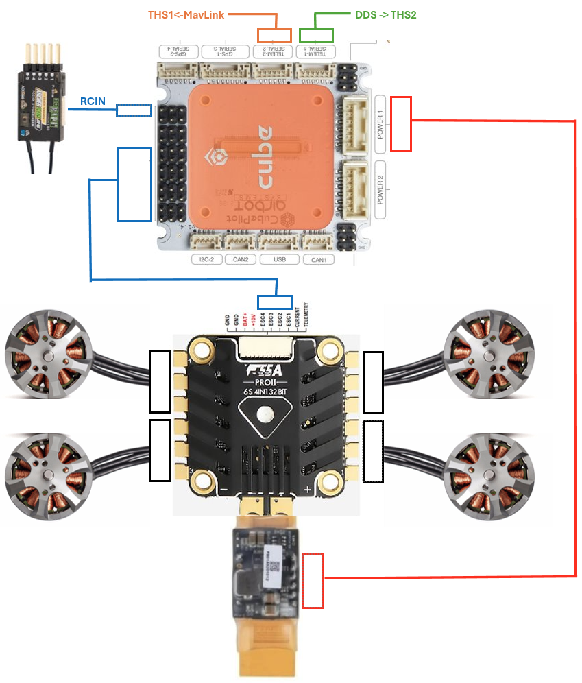
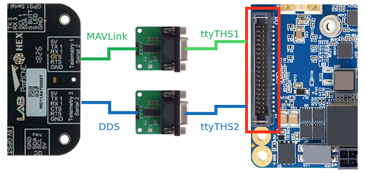
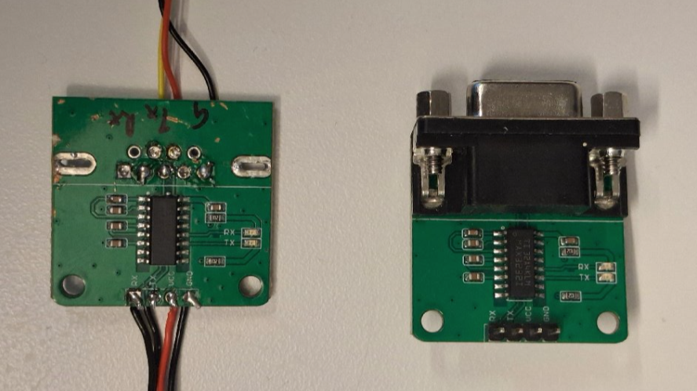
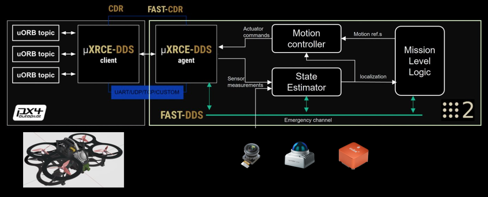
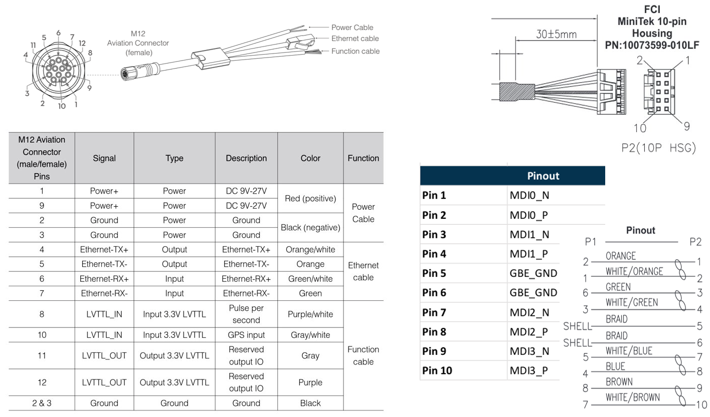

# Interfacing PX4 and Sensors

## 1)Wiring up PX4
Wire the Pixhawk up as shown in the diagram. Refer to the [official guide](https://docs.px4.io/main/en/assembly/quick_start_pixhawk4)


---

## 2) Connecting Px4
### PX4 Parameter setup
List of all the updated parmeters
TODO


### Hardware wiring
The Px4 serial runs TTL level logic and the connecttech Hadron carier runs Rs-232 level logic. We need to use [RS-232 To TTL Conveter (MAX3232IDR)](https://www.seeedstudio.com/RS-232-To-TTL-Conveter-MAX3232IDR-p-2851.html?srsltid=AfmBOoorzzVt8cIBUow6n3hfHMCEcNNeEVksGzzTceETeoXjmvNJLtpT) to establish connection.

The wiring should look like below.



> **Note:** In each connection, wire TX -> RX and RX -> TX

### Verify connection
To verify hardware level connections use ```minicom```. Set (Using the QgrundControl Parameter editer) and change port number and baudrates accordingly.
```bash
minicom -D /dev/ttyTHS2 -b 921600 -o -8
```

#### MicroXRCE DDS Primary link -> THS2

To verify primary control link to the Px4 Run this **AFTER** installing and launching ```agidocker```
```bash
agidocker
# *** Inside agidocker
cd /workspaces/dds
git clone -b v2.4.3 https://github.com/eProsima/Micro-XRCE-DDS-Agent.git
cd Micro-XRCE-DDS-Agent

```
According to the Fast RTPS documentation specify the ROS2 domain ID by adding the following to the participant profile into the `agent.refs`

```xml
<participant .....>
    <rtps>
        .....
        <builtin>
            <domainId>15</domainId>
        </buitin>
    </rtps>
</participan
```

```bash
mkdir build
cd build
cmake ..
make
sudo make install
sudo ldconfig /usr/local/lib/
sudo MicroXRCEAgent serial --dev /dev/ttyTHS2 -b 921600
```
#### MavLink Secondary telemetry link -> THS1
This link is for routing the Mavlink Trafic to a Ground station in the local network or to internet

Install and follow [Mavlink Anywhere guide](https://github.com/alireza787b/mavlink-anywhere)
1. **Clone the repository:**
   ```sh
   # *** On the Host machine (not inside the container)
   cd ~/workspace/dds
   git clone https://github.com/alireza787b/mavlink-anywhere.git
   cd mavlink-anywhere
   ```
2. **Run the installation script:**
   ```sh
   chmod +x install_mavlink_router.sh
   sudo ./install_mavlink_router.sh
   ```

3. **Run the configuration script:**
   ```sh
   chmod +x configure_mavlink_router.sh
   sudo ./configure_mavlink_router.sh
   ```
2. **Follow the prompts to set up UART device, baud rate, and UDP endpoints:**
   - If an existing configuration is found, the script will use these values as defaults and show them to you
   - **UART Device**: Set this to `/dev/ttyTHS1`. This is the serial port connected to the mavlink of PX4.
   - **Baud Rate**: Default is `57600`. This is the communication speed between the companion computer and connected devices
   - **UDP Endpoints**: Input the ground station ip. Default is `0.0.0.0:14550`. You can enter multiple endpoints separated by spaces (e.g., `100.110.200.3:14550 100.110.220.4:14550`), `14550` is the default port QGC connets to.

2. **Connecting with QGroundControl**
Use QGroundControl to connect to your companion computer's IP address on the configured UDP endpoints. For internet-based telemetry, make sure to follow the setup video to properly register your devices on your chosen VPN system or configure port forwarding on your router.


- **Check the status of the service:**
  ```sh
  sudo systemctl status mavlink-router
  ```
- **View detailed logs:**
  ```sh
  sudo journalctl -u mavlink-router -f
  ```
- **Check uxrce_dds_client status**
go into the MAVLink consol of QGC and 
  ```sh
  nsh> uxrce_dds_client status
  INFO  [uxrce_dds_client] Running, connected
  INFO  [uxrce_dds_client] Using transport:     serial
  INFO  [uxrce_dds_client] Payload tx:          65072 B/s
  INFO  [uxrce_dds_client] Payload rx:          0 B/s
  INFO  [uxrce_dds_client] timesync converged: true
  uxrce_dds_client: cycle: 49416 events, 174925511us elapsed, 3539.86us avg, min 136us max 1013110us 12206.498us rms
  uxrce_dds_client: cycle interval: 49424 events, 21668.49us avg, min 137us max 890938308us 4007537.750us rms
  ```
---

#### [Smart WiFi Manager Project](https://github.com/alireza787b/smart-wifi-manager)
Implement this if you need safe switiching between wifi APs

#### [NetBird VPN](https://netbird.io/)
NetBird can be used to 
- SSH to the drone over internet
- Forward data links like Mavlink telemetry over the internet
- Forward lightweight UI over the internet

## 3) Interfacing and Verifying sensor connection


### Livox Lidar

#### Why [Mid 360](https://www.livoxtech.com/mid-360/specs). 
- 360 degree wide FOV
- Foarm Factor
- Active anti inference
- Const performace

Refer to the [Datasheets](../../assets/datasheets/Livox_Mid-360_User_Manual_EN.pdf) and [Wiki](https://livox-wiki-en.readthedocs.io/en/latest/)

#### Hardware connection



- The power can be supplied directly from the 6S battery with a 60V capacitor for safety
- The Original cable can be terminated to have only the required lenngth and connected with the Eth connector from the connecttech to save weight.
- THe sync wires should be kept in the processes for later step.

After the physical connection is made using the Lovix connecter to the Ethernet port of the Jetson a statis network has to be made with following command.

> **Note:** We advice [modifying the static IP](https://github.com/Livox-SDK/livox_ros_driver2/issues/135) of the Livox lidar from 192.168.1.1XX to 172.16.0.XX to avoid issues assessing the local(Wifi) network when connected.


Add the static wired connection using the GUI or CLI as follows,
```bash
nmcli connection add type ethernet ifname eth0 con-name eth0-static ipv4.method manual ipv4.addresses 172.16.0.50/24 ipv4.gateway 255.255.255.0 ipv4.dns 8.8.8.8
nmcli connection up eth0-static

```

After the hardware connection is made the [livox_viewer2](https://www.livoxtech.com/downloads) can be used to verify connection and **firmware Update**.

#### SDK and ROS2 driver

This subsecton is recommended after setting up the docker.

Clone the [Lovox-SDK2](https://github.com/atinfinity/Livox-SDK2) and follow instructions to build. This custom SDK supports multi lidars. Set up the configuration with the device and host IPs.

For the fist time launch ```agidocker```, Compile and install the Livox-SDK2:

```shell
cd /workspaces/lidar_ws/src
git clone https://github.com/atinfinity/Livox-SDK2.git
cd Livox-SDK2
touch COLCON_IGNORE
mkdir build
cd build
cmake -DCMAKE_BUILD_TYPE=Release .. && make -j
sudo make install
sudo ldconfig
```

Clone the [livox_ros_driver2](https://github.com/atinfinity/livox_ros_driver2) and floow the isntructions.

```shell
cd /workspaces/lidar_ws/src
git clone https://github.com/atinfinity/livox_ros_driver2.git
cd ..
rosdep install -y -i --from-paths src/livox_ros_driver2
colcon build --symlink-install --cmake-args -DCMAKE_BUILD_TYPE=Release
```

> **Note:** Change the point cloud mode ```xfer_format``` to 2 (0) (PointCloud2) from the ROS2 driver if you are using DLIO

#### [DDS tuning](https://autowarefoundation.github.io/autoware-documentation/main/installation/additional-settings-for-developers/network-configuration/dds-settings/) to accomadate looseless pointcloud transfer (Optional)

##### 1. Tune system-wide network settings

- For fast DDS Add the following to:

```
/etc/sysctl.d/10-fastdds.conf
```

- For Cyclone DDS Add the following to:

```
/etc/sysctl.d/10-cyclonedds.conf
```


Then reboot Ubuntu.

```
net.core.rmem_max=2147483647  
net.core.rmem_default=2147483647  
net.core.wmem_max=2147483647  
net.core.wmem_default=2147483647  
net.ipv4.ipfrag_time=3  
net.ipv4.ipfrag_high_thresh=134217728
```

##### 2. Make configuration of Fast DDS

Create a configuration file:

```
$HOME/fastdds.xml
```

Refer to the default configuration here:
**[DEFAULT_FASTRTPS_PROFILES.xml](https://github.com/TheGoncaloSilva/middleware_test/blob/main/publisher/src/DEFAULT_FASTRTPS_PROFILES.xml)**

##### 3. Enable custom configuration for Fast DDS

  * Add the following description to `$HOME/.bashrc`.

<!-- end list -->

```bash
export FASTRTPS_DEFAULT_PROFILES_FILE=$HOME/fastdds.xml
export RMW_FASTRTPS_USE_QOS_FROM_XML=1
```

  * Please reopen terminal.


### Monocular Camera
Connect the camera to the USB interface and verify TODO

### Realsense Cameras
Connect the camera to the USB interface and verify TODO

### Depth AI setup for OAK-D cameras (Optional)

```bash
curl -fL https://docs.luxonis.com/install_dependencies.sh | bash

## later
cd isaac_ros_common/docker/
git clone https://github.com/luxonis/depthai-python.git
cd depthai-python/
git submodule update --init --recursive
```
---

## 7) Hardware Syncronisation

Refer the [Wiki](https://github.com/Livox-SDK/Livox-SDK/wiki/livox-device-time-synchronization-manual), [PX4](https://discuss.px4.io/t/how-to-test-the-time-synchronization-between-radar-and-camera)

### PPS method

This method is used when PTP is unavailable on the host side (i.e. Jetson Orin NX).
[Ref](https://arxiv.org/pdf/2107.02625), [Source](https://github.com/Marselka/lidar-sync-mimics-GPS)
[Wiring](https://github.com/Livox-SDK/Livox-SDK/wiki/livox-device-time-synchronization-manual#2213-livox-converter-20)
[PX4 camera trigger](https://docs.px4.io/v1.12/en/peripherals/camera.html#trigger-hardware-configuration)

 Arduino keeps a **soft RTC** that tracks hours, minutes, seconds, and microseconds continuously, and every PPS it **resets/corrects** to the Jetson time. This gives **continuous microsecond-precision timestamps**, even if the Jetson update is slightly delayed.

Here’s the full refactored code:

---

### **Arduino Sketch – Soft RTC with PPS & Jetson Sync**

```cpp
#include <Arduino.h>

// -------------------- CONFIG --------------------
#define PPS_PIN 2           // PPS input pin
#define SERIAL_BAUD 9600    // GPS client output
#define JETSON_BAUD 115200  // Jetson time input

// -------------------- VARIABLES --------------------
volatile bool ppsTriggered = false;
volatile unsigned long ppsMicros = 0;

String jetsonTime = "";       // Latest time from Jetson
String gprmcString = "";

// Soft RTC
volatile uint8_t soft_h = 0;
volatile uint8_t soft_m = 0;
volatile uint8_t soft_s = 0;
volatile uint32_t soft_us = 0;

// -------------------- ISR --------------------
void PPS_ISR() {
  ppsTriggered = true;
  ppsMicros = micros();  // Timestamp of PPS
}

// -------------------- SETUP --------------------
void setup() {
  pinMode(PPS_PIN, INPUT);
  attachInterrupt(digitalPinToInterrupt(PPS_PIN), PPS_ISR, RISING);

  Serial.begin(SERIAL_BAUD);   // GPS output
  Serial1.begin(JETSON_BAUD);  // Jetson time input

  while (!Serial) {}
  while (!Serial1) {}
}

// -------------------- HELPERS --------------------

// Compute NMEA checksum
String computeChecksum(const String &s) {
  uint8_t checksum = 0;
  for (size_t i = 1; i < s.length(); i++) { // skip $
    checksum ^= s[i];
  }
  char buf[3];
  sprintf(buf, "%02X", checksum);
  return String(buf);
}

// Update soft RTC every loop iteration (non-blocking)
void updateSoftRTC() {
  static unsigned long lastMicros = 0;
  unsigned long now = micros();
  unsigned long dt = now - lastMicros;
  lastMicros = now;

  soft_us += dt;
  while (soft_us >= 1000000) {
    soft_us -= 1000000;
    soft_s++;
    if (soft_s >= 60) {
      soft_s = 0;
      soft_m++;
      if (soft_m >= 60) {
        soft_m = 0;
        soft_h++;
        if (soft_h >= 24) soft_h = 0;
      }
    }
  }
}

// Read Jetson time string (non-blocking, 50ms timeout)
void readTimeFromJetson() {
  if (Serial1.available()) {
    jetsonTime = Serial1.readStringUntil('\n');
  }
}

// Apply Jetson time to soft RTC at PPS
void syncSoftRTCtoJetson() {
  if (jetsonTime.length() < 19) return; // sanity check

  soft_h = jetsonTime.substring(0,2).toInt();
  soft_m = jetsonTime.substring(3,5).toInt();
  soft_s = jetsonTime.substring(6,8).toInt();
  soft_us = 0; // reset microseconds at PPS
}

// Build GPRMC string from soft RTC
void publishGPRMC() {
  // Default location from Jetson
  String lat = "5542.2389";
  String ns  = "N";
  String lon = "03741.6063";
  String ew  = "E";

  char hhmmss[16];
  sprintf(hhmmss, "%02d%02d%02d.%03ld", soft_h, soft_m, soft_s, soft_us/1000);

  // Date fields (optional fallback)
  int day = 20, mon = 11, year = 2025;
  if (jetsonTime.length() >= 19) {
    day = jetsonTime.substring(9,11).toInt();
    mon = jetsonTime.substring(12,14).toInt();
    year = jetsonTime.substring(15,19).toInt();
  }

  String msg = "$GPRMC,";
  msg += String(hhmmss) + ",A," + lat + "," + ns + "," + lon + "," + ew + ",0.0,0.0,";
  msg += String(day) + String(mon) + String(year % 100) + ",,,,";

  String cs = computeChecksum(msg);
  msg += cs + "\r\n";

  gprmcString = msg;
  Serial.print(gprmcString);
}

// -------------------- LOOP --------------------
void loop() {
  updateSoftRTC();       // continuously update soft RTC
  readTimeFromJetson();  // get latest Jetson time

  if (ppsTriggered) {
    ppsTriggered = false;
    syncSoftRTCtoJetson();  // apply Jetson time at PPS
    publishGPRMC();         // output NMEA message
  }
}
```

---

### **Jetson Python – UTC Time Before PPS**

```python
import serial
import time

# Serial to Arduino
ser = serial.Serial('/dev/ttyTHS1', 115200)

while True:
    t = time.gmtime()  # UTC time
    # Format: HH,MM,SS,DD,MM,YYYY
    line = "{:02},{:02},{:02},{:02},{:02},{:04}\n".format(
        t.tm_hour, t.tm_min, t.tm_sec,
        t.tm_mday, t.tm_mon, t.tm_year
    )
    ser.write(line.encode())
    time.sleep(0.5)  # adjust to send ~500ms before PPS
```

---

### ✅ **Features of this Version**

1. **Continuous soft RTC** tracks `hours:minutes:seconds:microseconds`.
2. **PPS interrupts** correct soft RTC using Jetson time.
3. **Microsecond-level GPRMC output** to GPS clients.
4. **Non-blocking loop**, reads Jetson asynchronously.
5. **Resilient to Jetson timing jitter**, no missing pulses.

---

### PTP method

In the absence of GPS and PPS hardware signals, PTP v2 can be used for time synchronization between Livox LiDAR/Hub and other devices. This method requires minimal external hardware support, and only requires a master clock device in the entire network.

1. **Set [UXRCE_DDS_SYCT](https://docs.px4.io/main/en/advanced_config/parameter_reference#UXRCE_DDS_SYNCT) to ```true```** - The messages from the flight controller have their timestamp adjusted with the estimated time offset between the flight controller and the onboard computer. Thus all the ROS2 messages would have a timestamp based on the time of the onboard computer.

2. **Setup lidar side PTPv2 Sync** - Follow instructions at the [official Livox wiki](https://github.com/Livox-SDK/Livox-SDK/wiki/livox-device-time-synchronization-manual#2-instructions-of-use)


### GPS method
This synchronization method can be used when Livox Hub is connected to multiple LiDARs. Livox Hub needs to be connected to the PPS signal of the GPS receiver and the time signal in GPRMC format. At this time, the LiDAR point cloud time will be automatically corrected to the GPS time.

Livox LiDAR can also use GPS synchronization, but it needs to connect the GPRMC signal to the PC, and then send the time data to the LiDAR through the SDK protocol.

> **Note:** Not implemented or tested on Agipix as the hardware platform do not have an GPS reciever at the moment

---