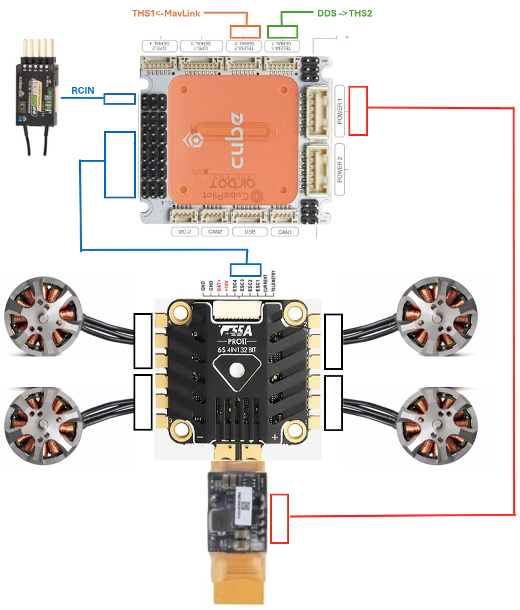
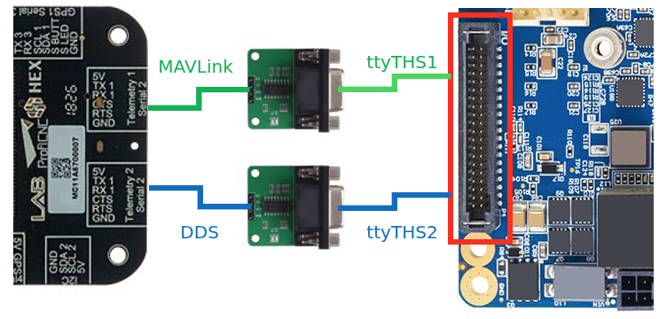
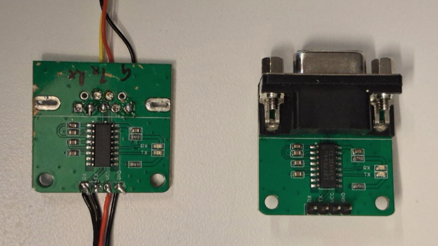
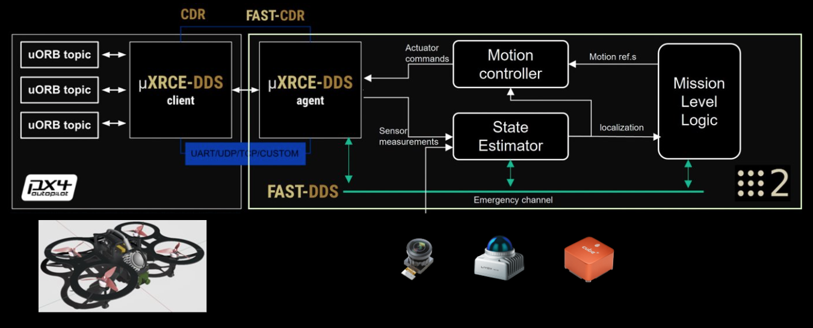
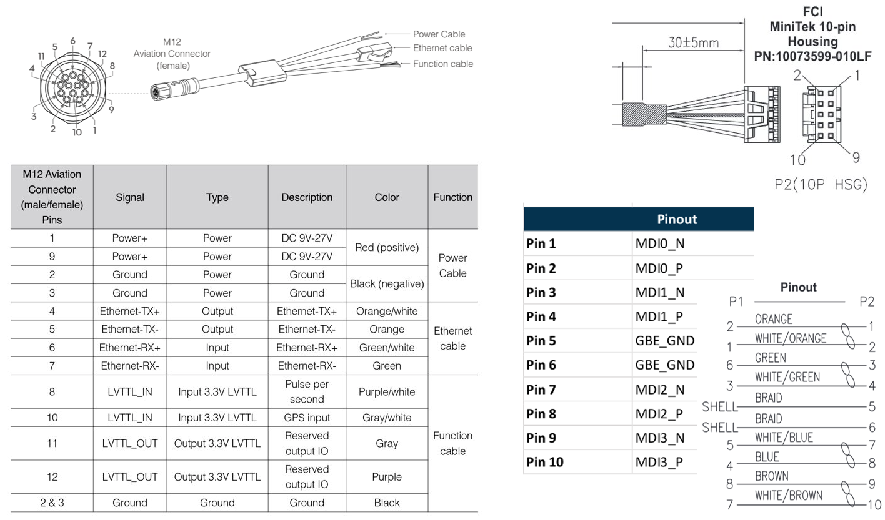

# Interfacing PX4 and Sensors

## 1)Wiring up PX4
Wire the Pixhawk up as shown in the diagram. Refer to the [official guide](https://docs.px4.io/main/en/assembly/quick_start_pixhawk4)


---

## 2) Connecting Px4
### PX4 Parameter setup

Flash the Pixhawk with the latest stable branch branch using QGroundControl. Branch `1.16.0` is tested.

List of all the updated parmeters
TODO


### Hardware wiring
The Px4 serial runs TTL level logic and the connecttech Hadron carier runs Rs-232 level logic. We need to use [RS-232 To TTL Conveter (MAX3232IDR)](https://www.seeedstudio.com/RS-232-To-TTL-Conveter-MAX3232IDR-p-2851.html?srsltid=AfmBOoorzzVt8cIBUow6n3hfHMCEcNNeEVksGzzTceETeoXjmvNJLtpT) to establish connection.

The wiring should look like below.





> **Note:** In each connection, wire TX -> RX and RX -> TX

## Flash PX4 with custom bootloader

### Install toolchain on host machine (Jetson)

```bash
# Linux packages
sudo apt install git make cmake python3-pip

# Python packages
pip install kconfiglib jinja2 empy jsonschema pyros-genmsg packaging toml numpy future

cd $HOME
git clone https://github.com/PX4/PX4-Autopilot.git -b v1.16.1 --recursive
cd PX4-Autopilot

# 1. Run the official PX4 Ubuntu setup script (it handles apt packages and toolchains)
cd ~/PX4-Autopilot
bash Tools/setup/ubuntu.sh

# 2. Restart your terminal session to apply the new path modifications
exec bash
```
### Build the firmware 

```bash
make cubepilot_cubeorangeplus_default
```

### Flash the firmware 

**Manual Flashing via GUI:** You want to generate the .px4 file on your machine but prefer to flash it manually using QGroundControl's custom firmware option

1. Generate firmware
```bash
make cubepilot_cubeorangeplus_default
```
2. Flash firmware using QGC
1. Open QGC 
2. Go to **Vehicle Setup** > **Firmware** > scroll to the bottom > click **Custom Firmware** 
3. Select the generated .px4 file from your build directory (e.g., ~/PX4-Autopilot/build/cubeorangeplus_default/px4_firmware/nuttx-px4fmu-v3.bin).
4. Start flashing
5. Follow the on-screen instructions to complete the update

**Auto upload:** You want to generate and upload the firmware directly from the terminal

```bash
make cubepilot_cubeorangeplus_default upload
```


### Verify connection
To verify hardware level connections use ```minicom```. Set (Using the QgrundControl Parameter editer) and change port number and baudrates accordingly.
```bash
minicom -D /dev/ttyTHS2 -b 921600 -o -8
```

#### MicroXRCE DDS Primary link -> THS2

To verify primary control link to the Px4 Run this **AFTER** installing and launching ```agidocker```
```bash
agidocker
# *** Inside agidocker
cd /workspaces/dds
git clone -b v2.4.3 https://github.com/eProsima/Micro-XRCE-DDS-Agent.git
cd Micro-XRCE-DDS-Agent

```
According to the Fast RTPS documentation specify the ROS2 domain ID by adding the following to the participant profile into the `agent.refs`

```xml
<participant .....>
    <rtps>
        .....
        <builtin>
            <domainId>15</domainId>
        </buitin>
    </rtps>
</participan
```

```bash
# *** Inside agidocker
mkdir build
cd build
cmake ..
make
sudo make install
sudo ldconfig /usr/local/lib/
sudo MicroXRCEAgent serial --dev /dev/ttyTHS2 -b 921600
```
#### MavLink Secondary telemetry link -> THS1
This link is for routing the Mavlink Trafic to a Ground station in the local network or to internet

Install and follow [Mavlink Anywhere guide](https://github.com/alireza787b/mavlink-anywhere)
1. **Clone the repository:**
   ```sh
   # *** On the Host machine (not inside the container)
   cd ~/workspace/dds
   git clone https://github.com/alireza787b/mavlink-anywhere.git
   cd mavlink-anywhere
   ```
2. **Run the installation script:**
   ```sh
   chmod +x install_mavlink_router.sh
   sudo ./install_mavlink_router.sh
   ```

3. **Run the configuration script:**
   ```sh
   chmod +x configure_mavlink_router.sh
   sudo ./configure_mavlink_router.sh
   ```
2. **Follow the prompts to set up UART device, baud rate, and UDP endpoints:**
   - If an existing configuration is found, the script will use these values as defaults and show them to you
   - **UART Device**: Set this to `/dev/ttyTHS1`. This is the serial port connected to the mavlink of PX4.
   - **Baud Rate**: Default is `57600`. This is the communication speed between the companion computer and connected devices
   - **UDP Endpoints**: Input the ground station ip. Default is `0.0.0.0:14550`. You can enter multiple endpoints separated by spaces (e.g., `100.110.200.3:14550 100.110.220.4:14550`), `14550` is the default port QGC connets to.

2. **Connecting with QGroundControl**
Use QGroundControl to connect to your companion computer's IP address on the configured UDP endpoints. For internet-based telemetry, make sure to follow the setup video to properly register your devices on your chosen VPN system or configure port forwarding on your router.


- **Check the status of the service:**
  ```sh
  sudo systemctl status mavlink-router
  ```
- **View detailed logs:**
  ```sh
  sudo journalctl -u mavlink-router -f
  ```
- **Check uxrce_dds_client status**
go into the MAVLink consol of QGC and 
  ```sh
  nsh> uxrce_dds_client status
  INFO  [uxrce_dds_client] Running, connected
  INFO  [uxrce_dds_client] Using transport:     serial
  INFO  [uxrce_dds_client] Payload tx:          65072 B/s
  INFO  [uxrce_dds_client] Payload rx:          0 B/s
  INFO  [uxrce_dds_client] timesync converged: true
  uxrce_dds_client: cycle: 49416 events, 174925511us elapsed, 3539.86us avg, min 136us max 1013110us 12206.498us rms
  uxrce_dds_client: cycle interval: 49424 events, 21668.49us avg, min 137us max 890938308us 4007537.750us rms
  ```

> ***Troubleshoot*** : If `ros2 topic list`do not show the /fmu/.. topics, check if the domain id settings match between the **ROS2** in the docker, **uxrce_dds_client** and the **MicroXRCEAgent**
---

#### [Smart WiFi Manager Project](https://github.com/alireza787b/smart-wifi-manager)
Implement this if you need safe switiching between wifi APs
```bash
cd ~/workspace/dds
git clone https://github.com/alireza787b/smart-wifi-manager.git
cd smart-wifi-manager
sudo bash install.sh
sudo systemctl status smart-wifi-manager.service
sudo ./configure_smart_wifi_manager.sh
```

#### [NetBird VPN](https://netbird.io/)
NetBird can be used to 
- SSH to the drone over internet
- Forward data links like Mavlink telemetry over the internet
- Forward lightweight UI over the internet

```bash
curl -fsSL https://pkgs.netbird.io/install.sh | sh
netbird up 

# to add ssh keys to the remote host
ssh-copy-id sasa@<hostname>

# to reset key of ssh connections 
ssh-keygen -f "/home/sasa/.ssh/known_hosts" -R "<hostname>"


# Reconfigure mavlink router to add the GS ip over netbird
cd ~/workspace/dds/smart-wifi-manager
sudo ./configure_mavlink_router.sh
```

## 3) Interfacing and Verifying sensor connection


### Livox Lidar

#### Why [Mid 360](https://www.livoxtech.com/mid-360/specs). 
- 360 degree wide FOV
- Foarm Factor
- Active anti inference
- Const performace

Refer to the [Datasheets](../../assets/datasheets/Livox_Mid-360_User_Manual_EN.pdf) and [Wiki](https://livox-wiki-en.readthedocs.io/en/latest/)

#### Hardware connection



- The power can be supplied directly from the 6S battery with a 60V capacitor for safety
- The Original cable can be terminated to have only the required lenngth and connected with the Eth connector from the connecttech to save weight.
- THe sync wires should be kept in the processes for later step.

After the physical connection is made using the Lovix connecter to the Ethernet port of the Jetson a statis network has to be made with following command.

> **Note:** We advice [modifying the static IP](https://github.com/Livox-SDK/livox_ros_driver2/issues/135) of the Livox lidar from 192.168.1.1XX to 172.16.0.XX to avoid issues assessing the local(Wifi) network when connected.


Add the static wired connection using the GUI or CLI as follows, Following command assumes the ethernet interface is **enP8p1s0** and lidar ip is **172.16.0.50**.
```bash
sudo nmcli connection add type ethernet ifname enP8p1s0 con-name static-link ipv4.method manual ipv4.addresses 172.16.0.50/24 ipv4.gateway 172.16.0.1 ipv4.dns 8.8.8.8
sudo nmcli connection up static-link
```

After the hardware connection is made the [livox_viewer2](https://www.livoxtech.com/downloads) can be used to verify connection and **firmware Update**.

#### SDK and ROS2 driver

This subsecton is recommended after setting up the docker.

Clone the [Lovox-SDK2](https://github.com/atinfinity/Livox-SDK2) and follow instructions to build. This custom SDK supports multi lidars. Set up the configuration with the device and host IPs.

For the fist time launch ```agidocker```, Compile and install the Livox-SDK2:

```shell
agidocker
# Inside agidocker
cd /workspaces/lidar_ws/src
git clone https://github.com/atinfinity/Livox-SDK2.git
cd Livox-SDK2
touch COLCON_IGNORE
mkdir build
cd build
cmake -DCMAKE_BUILD_TYPE=Release .. && make -j
sudo make install
sudo ldconfig
```

Clone the [livox_ros_driver2](https://github.com/atinfinity/livox_ros_driver2) and follow the instructions.

```bash
agidocker
# Inside agidocker
cd /workspaces/lidar_ws/src
git clone https://github.com/SasaKuruppuarachchi/livox_ros_driver2.git
cd ..
rosdep update
rosdep install -y -i --from-paths src/livox_ros_driver2
colcon build --symlink-install --cmake-args -DCMAKE_BUILD_TYPE=Release
```

> **Note:** 
> - In `launch/msg_MID360_launch.py` change the point cloud mode ```xfer_format``` to 0 (1) Pointcloud2(PointXYZRTL) from the ROS2 driver if you are using DLIO.
> - `src/comm/pub_handler.cpp` has been modified to Skip points inside the bounding box of the robot.
> - In `config/MID360_config.json` updated the sensor IP and the pitch to correlate to the 45 degree pitch of the Lidar

##### Verify
```bash
ros2 launch livox_ros_driver2 rviz_MID360_launch.py
```


#### [DDS tuning](https://autowarefoundation.github.io/autoware-documentation/main/installation/additional-settings-for-developers/network-configuration/dds-settings/) to accomadate looseless pointcloud transfer (Optional)

##### 1. Tune system-wide network settings

- For fast DDS Add the following to:

```
/etc/sysctl.d/10-fastdds.conf
```

- For Cyclone DDS Add the following to:

```
/etc/sysctl.d/10-cyclonedds.conf
```


Then reboot Ubuntu.

```
net.core.rmem_max=2147483647  
net.core.rmem_default=2147483647  
net.core.wmem_max=2147483647  
net.core.wmem_default=2147483647  
net.ipv4.ipfrag_time=3  
net.ipv4.ipfrag_high_thresh=134217728
```

##### 2. Make configuration of Fast DDS

Create a configuration file:

```
$HOME/fastdds.xml
```

Refer to the default configuration here:
**[DEFAULT_FASTRTPS_PROFILES.xml](https://github.com/TheGoncaloSilva/middleware_test/blob/main/publisher/src/DEFAULT_FASTRTPS_PROFILES.xml)**

##### 3. Enable custom configuration for Fast DDS

  * Add the following description to `$HOME/.bashrc`.

<!-- end list -->

```bash
export FASTRTPS_DEFAULT_PROFILES_FILE=$HOME/fastdds.xml
export RMW_FASTRTPS_USE_QOS_FROM_XML=1
```

  * Please reopen terminal.


### Monocular Camera
Connect the camera to the USB interface and verify TODO

### Realsense Cameras
Install libraries on the host side for realsense cameras. This also installs udev rules for the camera

```bash
# Ensure the directory exists
sudo mkdir -p /etc/apt/keyrings

# Download and dearmor
curl -sSf https://librealsense.realsenseai.com/Debian/librealsenseai.asc | \
gpg --dearmor | sudo tee /etc/apt/keyrings/librealsenseai.gpg > /dev/null

echo "deb [signed-by=/etc/apt/keyrings/librealsenseai.gpg] https://librealsense.realsenseai.com/Debian/apt-repo `lsb_release -cs` main" | \
sudo tee /etc/apt/sources.list.d/librealsense.list
sudo apt-get update

sudo apt-get install librealsense2-utils
sudo apt-get install librealsense2-dev
```

Connect the camera to the USB interface and verify 
```bash
agidocker 
# Inside agidocker use this commnad
realsense-viewer
```
If the connection is stable you can move on to launching `realsense2_camera` ROS2 package

### Depth AI setup for OAK-D cameras (Optional)

```bash
curl -fL https://docs.luxonis.com/install_dependencies.sh | bash

## later
cd isaac_ros_common/docker/
git clone https://github.com/luxonis/depthai-python.git
cd depthai-python/
git submodule update --init --recursive
```
---

Next step is [Hardware Syncronisation](./5_hardware_syncronisation.Md)