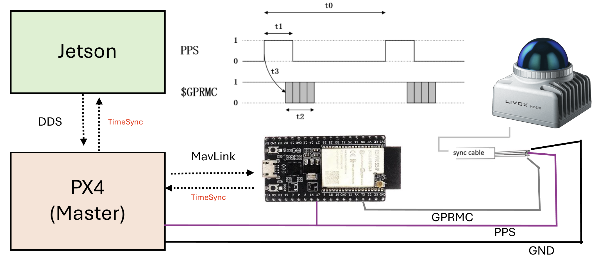

# Hardware Syncronisation with ESP32 TimerSync Bridge

The default timesync method for Livox Lidars are PTP. But unfortunatly Jetson NX does not support PTP. The alternative in the official documentation is to use PPS syncronisation with GPS. As indoor focused robots do not have GPS, we designed the following solution to provide GPRMC and PPS signals to the Livox LiDAR and Px4 via a ESP32.

The ESP32 generates three hardware-synchronised outputs and disciplines its clock to the PX4 flight controller via MAVLink over UART.

The code can be found at [TimerSyncBridge](https://github.com/SasaKuruppuarachchi/esp32_timersync-open.git)


---

## System Architecture

```
                          ┌─────────────────────────────────────┐
                          │   DFRobot FireBeetle 2 ESP32-S3     │
                          │                                     │
  PX4 Flight Controller   │  ┌──────────────────────────────┐   │
  (DDS time source)       │  │  Clock Discipline Layer      │   │
  GPS2  UART  ◄──────────►│  │  UNLOCKED → WARMING → LOCKED │   │
  GPIO 38/3               │  │  Source: SYSTEM_TIME MAVLink │   │
  57600 baud              │  └──────────┬───────────────────┘   │
                          │             │ UTC epoch              │
                          │  ┌──────────▼───────────────────┐   │
                          │  │  Output Generation           │   │
                          │  │  • 10 Hz PWM  GPIO 4 (LEDC)  │   │
                          │  │  • 1 Hz PPS   GPIO 5 (timer) │   │
                          │  │  • GPRMC      GPIO 12 UART1  │   │
                          │  └──┬──────────┬────────────────┘   │
                          └─────┼──────────┼──────────────────┘
                                │          │
               ┌────────────────┘          └──────────────────────────┐
               ▼                                                       ▼
  ┌────────────────────┐                          ┌────────────────────────────┐
  │  Hikrobot MVS      │                          │  Livox Mid-360             │
  │  Camera            │                          │  LiDAR                     │
  │  Line0 OPTO_IN     │                          │  Pin 8: PPS (Purple/white) │
  │  10 Hz trigger     │                          │  Pin 10: GPS/GPRMC         │
  │  → image timestamp │                          │    (Gray/white, UART 9600) │
  └────────────────────┘                          │  → UTC LiDAR stamps        │
                                                  └────────────────────────────┘
```

### Signal timing relationship

```
  1 Hz sync (GPIO 5)    ───┐           ┌───         ┌───
                           └───────────┘           └───
                           ▲ rising edge = UTC second boundary
                           │
  10 Hz trigger (GPIO 4)  ─┐─┐─┐─┐─┐  ←─ phase-reset here ─► ─┐─┐─┐─┐─┐
                            │ │ │ │ │                            │ │ │ │ │
                           100ms period, 50% duty

  GPRMC (GPIO 12 UART1)   ──[HHMMSS.00,A,...]──────────────────[HH:MM:SS+1,A,...]──
                           ▲ emitted on same rising edge
```

Every 1 Hz rising edge: LEDC timer reset (phase-aligns 10 Hz) → time increment → GPRMC emit.

---

## Hardware

| Component | Part |
|---|---|
| Timing board | DFRobot FireBeetle 2 ESP32-S3 |
| LiDAR | Livox Mid-360 |
| Camera | Hikrobot MVS (TriggerSource=LINE0) |
| Flight controller | PX4 (time sourced from companion via DDS, no GPS) |

---

## GPIO Pinout (as-built)

| Function | GPIO | Direction | Destination |
|---|---:|---|---|
| 10 Hz camera trigger | 4 | OUT | MVS camera Line0 OPTO_IN |
| 1 Hz PPS sync | 5 | OUT | Mid-360 M12 PPS interface (Pin 8, purple/white) (direct TTL) |
| GPRMC UART1 TX | 12 | OUT | Mid-360 M12 GPS input (Pin 10, Gray/white, UART 9600) |
| GPRMC UART1 RX | 13 | IN | Reserved, unused |
| MAVLink UART2 TX | 38 | OUT | PX4 GPS2 RX |
| MAVLink UART2 RX | 3 | IN | PX4 GPS2 TX |
| Status LED | 2 | OUT | On-board LED (0.5 Hz blink when LOCKED) |

---

## Px4 setup

Update Following parameters on PX4 to enable MAVLink time sync over UART2:
for refrance the project uses GPS2 port on PX4, so the parameters are:

```
MAV_1_CONFIG=GPS2
SER_GPS2_BAUD=57600
SER_GPS2_PROTO=1  # MAVLink v2
SER_GPS2_OPTIONS=0  # No flow control, no 9-bit, etc

UXRCE_DDS_SYCT=1
```


---

## Full Wiring Diagram

```
  FireBeetle 2 ESP32-S3
  ┌─────────────────────────────────────────────────────┐
  │                                                     │
  │  GPIO 4  ──────────────────────────────────────────►│  MVS Camera
  │  (10 Hz PWM 50% duty)                               │  Line0 OPTO_IN PIN 2
  │                                                     │
  │  GPIO 5  ──────────────────────────────────────────►│  Livox Mid-360
  │  (1 Hz PPS TTL 50% duty)                            │  M12 PPS interface (Pin 8, Purple/white)*
  │                                                     │  
  │  GPIO 12 (UART1 TX) ──┐────────────────────────────►│  M12 GPS input (Pin 10, Gray/white, UART 9600)*
  │  GPIO 13 (UART1 RX) ──┤                             │             
  │  (9600 baud GPRMC)    │                             │
  │                       ▼                             │
  │                  USB-Serial adapter                 │
  │                       │                             │
  │                       ▼                             │
  │                  Host /dev/ttyUSB0                  │
  │                  (to debug)                         │
  │                                                     │
  │  GPIO 38 (UART2 TX)  ──────────────────────────────►│  PX4 GPS2 RX
  │  GPIO  3 (UART2 RX)  ◄──────────────────────────────│  PX4 GPS2 TX
  │  (57600 baud MAVLink)                               │
  │  GND ───────────────────────────────────────────────│  PX4 GND
  │                                                     │
  │  USB-C (USB-CDC) ──────────────────────────────────►│  Host /dev/ttyACM0
  │  (115200 baud console)                              │  pio device monitor
  │                                                     │
  └─────────────────────────────────────────────────────┘
```
*(direct TTL for Mid-360 or when using the Livox converter 2.0, but RS485 is needed when using other LiDARs )
> **Mid-360 PPS note:** The Mid-360 accepts direct TTL on its M12 PPS interface. No TTL-to-RS485 converter is required.

> **UART TX/RX crossing:** GPIO 38 (TX) → PX4 GPS2 RX, GPIO 3 (RX) ← PX4 GPS2 TX. Cross the wires. Shared GND is mandatory.

---

## Clock Discipline Flow

```
  Power on
      │
      ▼
  UNLOCKED ──── no SYSTEM_TIME with valid epoch ────► UNLOCKED
      │
      │  SYSTEM_TIME.time_unix_usec > 1e15 µs (DDS converged)
      ▼
  WARMING ──── 3 consecutive SYSTEM_TIME samples ────► seed epoch, step-correct each
      │
      │  3 samples accumulated
      ▼
  LOCKED ──── ongoing SYSTEM_TIME updates ───────────► slew ±500 µs/update (D6)
      │                                                 GPRMC emits disciplined UTC
      │  DDS link lost
      ▼
  DEGRADED ── DDS re-converges ──────────────────────► WARMING (re-seeds)

  GPRMC output:  LOCKED → disciplined UTC sentences
                 all other states → suppressed (no output)

  1 Hz pulse and 10 Hz trigger: always running regardless of lock state
```

---

## Build and Flash

### Prerequisites
- PlatformIO CLI or VS Code PlatformIO extension
- `duracopter/MAVLink v2 C library@^2.0` (already in `platformio.ini`)

### Flash
```bash
pio run -t upload
```

### Monitor USB-CDC console
```bash
pio device monitor -b 115200
```

### Verify LiDAR time sync
The GPRMC signal goes directly to the LiDAR (M12 pin 10). Verify sync in `livox_ros_driver2` log — look for:
```
timestamp_type changed to 2
```
This confirms the LiDAR has accepted the GPRMC and switched to GPS/UART time sync mode.

---

## Expected Console Output

### Startup banner (Phase 4)
```
=== ESP32-S3 Phase 4 Timing Firmware ===
Board: DFRobot FireBeetle2 ESP32-S3
10Hz PWM trigger: GPIO 4 (LEDC low-speed timer0, 50% duty)
1Hz sync pulse:   GPIO 5 (esp_timer 500ms toggle, 50% duty)
GPRMC UART1:      TX GPIO 12, RX GPIO 13 @ 9600 baud
MAVLink UART2:    TX GPIO 38, RX GPIO 3 @ 57600 baud
DDS sync gate:    SYSTEM_TIME unix_us > 1e15 us (year >2001)
Clock discipline: UNLOCKED -> WARMING(3 samples) -> LOCKED
Max slew:         500 us/update  (D6 monotonic invariant)
GPRMC output:     disciplined UTC when LOCKED, suppressed otherwise
Invariant: on each 1Hz rising edge -> LEDC timer reset + monotonic time increment + GPRMC emit
```

### Before DDS lock (UNLOCKED/WARMING)
```
[1Hz] free=00:00:01 - GPRMC SUPPRESSED (clk=UNLOCKED), 10Hz phase reset
[MAV] HEARTBEAT sysid=1 compid=1 type=2 autopilot=12 base_mode=0x1D state=0
[MAV] SYSTEM_TIME unix_us=1780491609038000 boot_ms=2498713  dds=CONVERGED
[MAV] *** PX4 DDS timesync: CONVERGED — clock is valid ***
[CLK] state=WARMING sample=1/3  seed_unix_us=1780491609038000
[1Hz] free=00:00:02 - GPRMC SUPPRESSED (clk=WARMING), 10Hz phase reset
[CLK] state=WARMING sample=2/3  offset=1711 us
[CLK] state=WARMING sample=3/3  offset=-15801 us
[CLK] *** state=LOCKED — disciplined clock valid ***
```

### After LOCKED
```
[1Hz] disc=13:00:15 free=00:00:08 - GPRMC emitted (LOCKED), 10Hz phase reset
[CLK] state=LOCKED  disc_utc=13:00:16  offset=-1178 us  corr=-500 us  total_corr=-500 us  drift_trend=14623 us
[HB] uptime=10s  free=00:00:10  disc_utc=13:00:17  clk=LOCKED  px4_dds=CONVERGED
[MAV] TIMESYNC RTT=20639 us
```

### GPRMC output (GPIO 12 → Mid-360 pin 10, 9600 baud, after LOCKED)
```
$GPRMC,130015.00,A,2237.496474,N,11356.089515,E,0.0,225.5,230520,2.3,W,A*2E
$GPRMC,130016.00,A,2237.496474,N,11356.089515,E,0.0,225.5,230520,2.3,W,A*2D
$GPRMC,130017.00,A,2237.496474,N,11356.089515,E,0.0,225.5,230520,2.3,W,A*2C
```
Time field reflects real UTC from PX4. Checksum is valid NMEA XOR. Status field is `A` (active).

---

## livox_ros_driver2 Configuration

Time sync is configured in the Livox SDK JSON config used by `livox_ros_driver2`. The ESP32 acts as a GPS emulator — it provides both the 1 Hz PPS hardware edge (Mid-360 pin 8) and the GPRMC sentence (Mid-360 pin 10) directly. No host serial adapter is needed.

Reference: [Livox time sync via UART](https://livox-wiki-en.readthedocs.io/en/latest/tutorials/new_product/common/time_sync.html#synchronization-via-uart)

The driver validates: `$GPRMC`/`$GNRMC` prefix, status field `A`, and checksum. It does **not** validate position or that the UTC value is current.

### Verification
After launching `livox_ros_driver2`, look for this log entry:
```
timestamp_type changed to 2
```
`timestamp_type 2` = GPS/UART sync active. If it reads `0` or `1`, the GPRMC signal is not reaching the LiDAR — check the GPIO 12 → pin 10 wire and GND continuity.

---

## Project Status

| Phase | Description | Status |
|---|---|---|
| 1 | ESP32 board bring-up — LEDC 10 Hz, 1 Hz PPS, free-running GPRMC | ✅ COMPLETE |
| 2 | MAVLink link bring-up — HEARTBEAT, SYSTEM_TIME, TIMESYNC via UART2 | ✅ COMPLETE |
| 3 | Clock discipline — DDS-gated UNLOCKED→WARMING→LOCKED state machine | ✅ COMPLETE |
| 4 | Disciplined GPRMC — UTC time from PX4 drives GPRMC output | ✅ COMPLETE — 32 min soak verified (offset ±13 ms, zero DEGRADED, ~16 µs/min drift) |
| 5 | Full integration — Mid-360 + MVS camera end-to-end | ✅ COMPLETE — PPS sync active, `timestamp_type changed to 2` confirmed |

---

## Phase 4 Soak Results (32-minute pre-Phase-5 run)

Continuous run with PX4 DDS active, no sensor hardware connected yet.

| Metric | Observed | Pass threshold |
|---|---|---|
| Clock state | LOCKED throughout | no DEGRADED transitions |
| Uptime | 1931 s (32 min) | — |
| GPRMC gaps | 0 | 0 |
| LOCKED offset range | ±13 ms | < ±50 ms (UART jitter) |
| Accumulated drift correction | −31 ms over 32 min (~16 µs/min) | stable tracking |
| MAVLink RTT | 20.6 ms (stable) | < 100 ms |
| px4_dds status | CONVERGED throughout | CONVERGED |

Representative log extract (uptime 1931 s):
```text
[HB] uptime=1931s  free=00:32:12  disc_utc=13:32:19  clk=LOCKED  px4_dds=CONVERGED
[CLK] state=LOCKED  disc_utc=13:32:20  offset=-12605 us  corr=-500 us  total_corr=-32166 us
[MAV] TIMESYNC RTT=20636 us
```

**Result: PASS.** Clock discipline is stable over the soak window. Proceeding to Phase 5.

## Phase 5 Integration Checklist

Connect the Mid-360 LiDAR and MVS camera to the ESP32 and run the full sensor stack.

**Step 1 — Wiring**
- GPIO 5 → Mid-360 M12 pin 8 (PPS, Purple/white, direct TTL 3.3V, no RS485)
- GPIO 12 UART1 TX → Mid-360 M12 pin 10 (GPS input, Gray/white, direct TTL 3.3V)
- GPIO 4 → MVS camera Line0 OPTO_IN
- Shared GND between ESP32 and Mid-360 M12 connector

**Step 2 — Host config**
- No serial adapter needed — GPRMC goes directly to LiDAR hardware
- Set camera: `TriggerMode=1`, `TriggerSource=LINE0`, `ExposureTime=5000`

**Step 3 — Launch**
- Flash ESP32 (`pio run -t upload`)
- Wait for `[CLK] *** state=LOCKED` in console before starting ROS nodes
- Launch `livox_ros_driver` and MVS camera driver

**Verification gate:**
- [ ] `livox_ros_driver2` log shows `timestamp_type changed to 2` on startup
- [ ] LiDAR point cloud timestamps are UTC-anchored (`sec` matches current UTC, not boot-relative)
- [ ] MVS camera triggers at 10 Hz confirmed in ROS topic
- [ ] 30-minute continuous run — no DEGRADED transitions in ESP32 console log
- [ ] Rosbag captured for evidence

---

## Troubleshooting

| Symptom | Likely cause | Fix |
|---|---|---|
| No `[MAV] HEARTBEAT` | UART2 wiring wrong or baud mismatch | Check GPIO 38→PX4 RX, GPIO 3←PX4 TX, shared GND; verify `SER_TELx_BAUD=57600` on PX4 |
| `clk=WARMING` never advances | PX4 DDS not converged | Check `uxrce_dds_client status` on PX4 NSH — need `timesync converged: true` |
| GPRMC suppressed indefinitely | Clock never reaches LOCKED | Usually DDS convergence issue; see above |
| `livox_ros_driver2` does not show `timestamp_type changed to 2` | GPRMC not reaching LiDAR | Check GPIO 12 → Mid-360 pin 10 wire and shared GND; confirm ESP32 is LOCKED before starting driver |
| 10 Hz or 1 Hz signal absent | GPIO conflict or wiring | Confirm scope on GPIO 4 and GPIO 5; check no strapping pin conflict |
| Large offset at LOCKED entry | Normal — WARMING step-corrects | Offset drops to <20 ms within a few SYSTEM_TIME updates after LOCKED |

---

## Repository Layout

```
esp32_timersync-open/
├── src/
│   └── main.cpp              # All firmware — Phase 1–4 complete
├── include/                  # Headers (currently empty)
├── platformio.ini            # Board: dfrobot_firebeetle2_esp32s3, lib: MAVLink v2
└── .copilot_instrcutions/    # Project knowledge base
    ├── SYSTEM_KNOWLEDGE.md   # Hardware facts, signal specs, verified GPIO table
    ├── PLAN.md               # Phase-gated implementation plan
    └── DECISIONS.md          # Resolved decisions and open questions
```

## Documentaion Reference

* [Wiki](https://github.com/Livox-SDK/Livox-SDK/wiki/livox-device-time-synchronization-manual)
* [PX4](https://discuss.px4.io/t/how-to-test-the-time-synchronization-between-radar-and-camera)
* [Livox ROS Driver](https://github.com/Livox-SDK/livox_ros_driver2)
* [LIV_handhold](https://github.com/xuankuzcr/LIV_handhold)