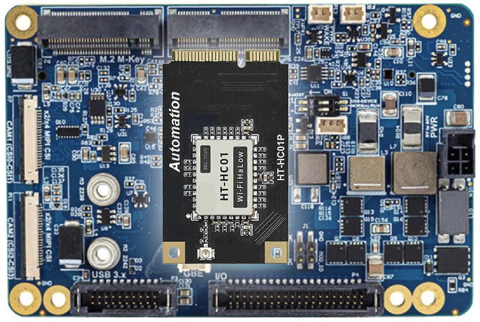
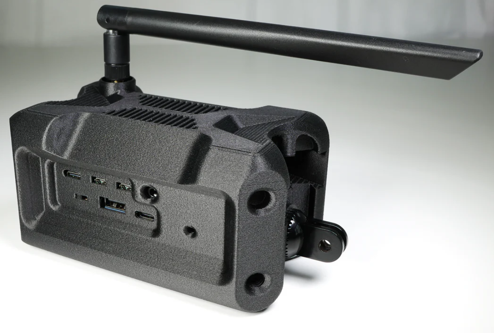

# MANET mesh networking upgrade (WIP)

This is a ***work in progress*** upgarde to the agipix framework to use the long rage robust capabilities of the [Wi-Fi HaLow](https://heltec.org/project/ht-hc01/) mesh networking.

A MANET (Mobile Ad-Hoc Network) is a self-forming wireless mesh where each node connects directly without centralized infrastructure. This technology is especially useful in the civilian space for search and rescue, disaster response, airsoft events, and any disconnected communications scenario. Designed to be budget-friendly with excellent long-range performance. The build is designed to integrate with ATAK over multicast, but works equally well over standard IP and internet links.

