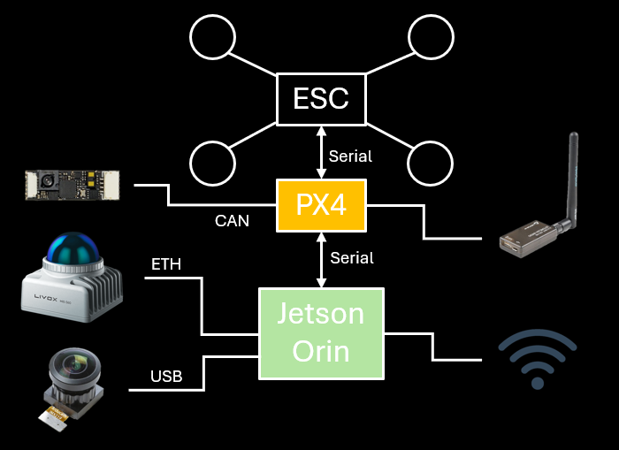
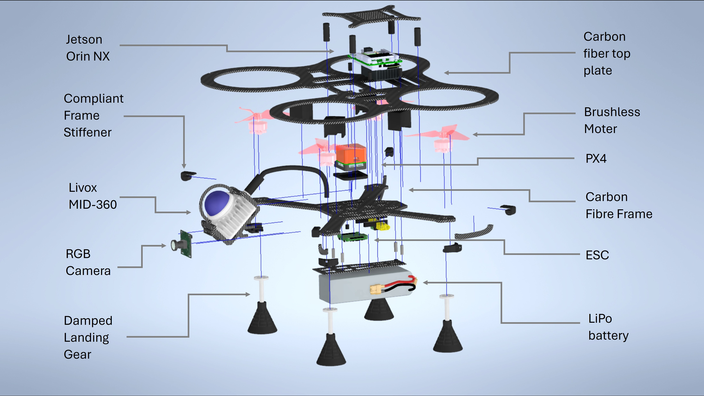

# Agipix (Real Robot) — Quick Guide

Use this page to jump into the full real-platform bring-up flow, from mechanical assembly to preflight checks.

## 1) Hardware Assembly

- Cut CF plates from the provided DXF patterns and post‑process as needed.
- Print TPU parts from the STL set (recommended: 0.2 mm layers, 40% infill; higher for bushings).
- Assemble frame, power, ESCs, motors, radio/telemetry, and flight controller.
- Complete low‑level checks and a brief manual flight validation.
- Mount compute (Jetson Orin NX + Hadron), antennas, wiring, and sensor cage (Livox Mid‑360, optional RGB/RGB‑D).

Read: [Hardware Assembly](./1_hardware_assembly.md)

## 2) Flashing the Hardware

- Target: JetPack 6.x (Jetson Linux R36.3) on Orin NX/Nano with Connect Tech carriers.
- Prepare BSP_ROOT with NVIDIA BSP + sample rootfs; install CTI L4T BSP.
- Put the board in recovery, then flash via CTI menu script or manual NVMe script.
- On first boot: complete setup, join Wi‑Fi, SSH in; consider NoMachine, nvpmodel, Docker/NVIDIA toolkit.
- Keep handy: CTI docs/KB and NVIDIA references linked in the guide.

Read: [Flashing Hardware](./2_flashing_hardware.Md)

## 3) PX4 and Sensor Interfacing
- PX4 low-level control wiring and DDS interface setup.
- LiDAR, monocular camera, and optional RGB-D sensor integration.

Read: [Interfacing Sensors](./4_interfacing_sensors.Md)

## 4) Container and Software Setup

- Runtime is containerized; follow isaac_ros_common Docker setup.
- Branches: `agipix-hard` (hardware), `agipix-sim` (simulation).
- For sim instructions, see the simulation docs; for autonomy, continue to perception stack.

Read: [Docker Build](./3_docker_build.Md) and [Software Setup](./6_software_setup.md)

## 5) MANET Mesh Networking
- Work-in-progress extension using [Wi-Fi HaLow](https://heltec.org/project/ht-hc01/) for long-range resilient links.

Read: [MANET Mesh Networking](./5_manet_mesh_networking.Md)

## 6) Preflight Checklist
- Mission readiness checks for power, sensing, comms, and safety.

Read: [Preflight Checklist](./7_preflight_checklist.md)

## Appendix — Hadron/Env Notes
File: `hadron_cfg.txt`

- Workspace layout hints for control, DDS agent, LiDAR drivers, and vision.
- Useful bash aliases and Docker entry helper.
- Sample nmcli snippet for a static wired IP.

.

---

Next steps:
- [Simulation Quick Guide](../sim/index.md)
- [Autonomy Quick Guide](../autonomy/index.md)
- [UI Quick Guide](../ui/index.md)
