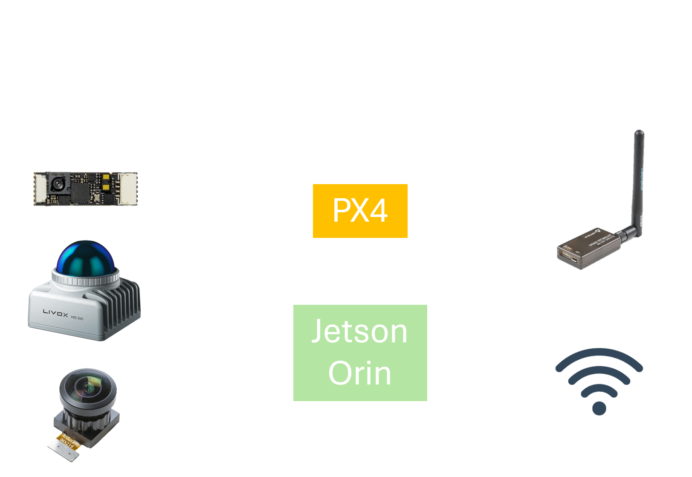

# Agipix (Real Robot) — Quick Guide

Use this page to jump into the real robot setup. Each section below gives a short summary and links to the full guide.

## 1) Hardware Assembly
Link: [Hardware Assembly](./1_hardware_assembly.md)

- Cut CF plates from the provided DXF patterns and post‑process as needed.
- Print TPU parts from the STL set (recommended: 0.2 mm layers, 40% infill; higher for bushings).
- Assemble frame, power, ESCs, motors, radio/telemetry, and flight controller.
- Complete low‑level checks and a brief manual flight validation.
- Mount compute (Jetson Orin NX + Hadron), antennas, wiring, and sensor cage (Livox Mid‑360, optional RGB/RGB‑D).

## 2) Flashing the Hardware
Link: [Flashing Jetson & Carrier](./2_flashing_hardware.Md)

- Target: JetPack 6.x (Jetson Linux R36.3) on Orin NX/Nano with Connect Tech carriers.
- Prepare BSP_ROOT with NVIDIA BSP + sample rootfs; install CTI L4T BSP.
- Put the board in recovery, then flash via CTI menu script or manual NVMe script.
- On first boot: complete setup, join Wi‑Fi, SSH in; consider NoMachine, nvpmodel, Docker/NVIDIA toolkit.
- Keep handy: CTI docs/KB and NVIDIA references linked in the guide.

## 3) Software Setup
Link: [Software Setup](./3_software_setup.md)

- Runtime is containerized; follow isaac_ros_common Docker setup.
- Branches: `agipix-hard` (hardware), `agipix-sim` (simulation).
- For sim instructions, see the simulation docs; for autonomy, continue to perception stack.

## Appendix — Hadron/Env Notes
File: `hadron_cfg.txt`

- Workspace layout hints for control, DDS agent, LiDAR drivers, and vision.
- Useful bash aliases and Docker entry helper.
- Sample nmcli snippet for a static wired IP.

---

Need simulation or autonomy next?
- Simulation: ../sim/[1_setup_sim](../sim/1_setup_sim.md)
- Autonomy: ../autonomy/[1_perception](../autonomy/1_perception.md)

