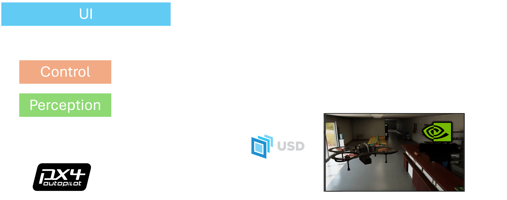

# Agipix (Simulation) — Quick Guide

Use this page to jump into the simulation setup. It stays brief and links to the full guide.

## Simulation Setup

- Host: Ubuntu 20.04/22.04, NVIDIA GPU/driver; optional Dockerized workflow via isaac_ros_common (branch `agipix-sim`).
- Install ROS 2 Humble and NVIDIA Omniverse Isaac Sim; enable the ROS 2 bridge extension.
- (Optional) Nucleus Server for assets; tmux for session management.
- PX4 SITL build and param tweak for DDS sync; ensure ROS 2 nodes use `use_sim_time`.
- NVIDIA Container Toolkit + Docker/Portainer if running inside containers.

## Run the Simulation
- Start Isaac Sim (first launch can take a while) and ensure the ROS 2 bridge is active.
- In the container/session, build and run the control stack; follow the provided tmux panes.
- Connect visualization via Foxglove at ws://localhost:8765 (see details in the setup doc).

 

	<iframe
		src="https://www.youtube.com/embed/tTsIn8vay7c"
		title="YouTube video player"
		frameborder="0"
		allow="accelerometer; autoplay; clipboard-write; encrypted-media; gyroscope; picture-in-picture; web-share"
		allowfullscreen
	></iframe>
	
Quadrotor Simulation of 3D mapping of cluttered environment in IsaacSIM using PX4 and ROS2 - Agipix

	<!-- To change the video, replace EMFauA1CU8M with the new YouTube ID. -->
	<!-- If you prefer privacy-enhanced mode, use: https://www.youtube-nocookie.com/embed/VIDEO_ID -->

## Next steps
- Continue to autonomy stack: 
- UI/teleop and mission flows: 
---

Looking for the real robot guide? See: 
