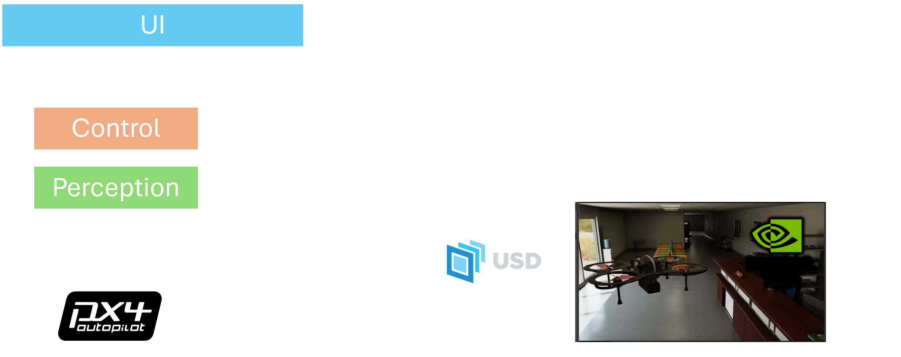

# Agipix (Simulation) — Quick Guide

Use this page to set up the AgiSIM digital twin workflow and run parity experiments before real flights.

## Simulation Setup

- Host: Ubuntu 20.04/22.04 with NVIDIA GPU drivers.
- Install ROS 2 Humble and NVIDIA Isaac Sim.
- Enable ROS 2 bridge extension and configure PX4 SITL + DDS.
- Keep the same containerized stack used on hardware for sim-to-real parity.

Read: [Docker Build](./1_docker_build.md) and [Simulation Setup](./2_setup_sim.md)

## Run the Simulation
- Start Isaac Sim (first launch can take a while) and ensure the ROS 2 bridge is active.
- In the container/session, build and run the control stack; follow the provided tmux panes.
- Connect visualization via Foxglove at ws://localhost:8765 (see details in the setup doc).

 

	<iframe
		src="https://www.youtube.com/embed/tTsIn8vay7c"
		title="YouTube video player"
		frameborder="0"
		allow="accelerometer; autoplay; clipboard-write; encrypted-media; gyroscope; picture-in-picture; web-share"
		allowfullscreen
	></iframe>
	
Quadrotor Simulation of 3D mapping of cluttered environment in IsaacSIM using PX4 and ROS2 - Agipix

	<!-- To change the video, replace EMFauA1CU8M with the new YouTube ID. -->
	<!-- If you prefer privacy-enhanced mode, use: https://www.youtube-nocookie.com/embed/VIDEO_ID -->

## Next steps
- Continue to [Autonomy Quick Guide](../autonomy/index.md)
- Continue to [UI Quick Guide](../ui/index.md)
- Going to hardware: [Real Robot Quick Guide](../real/index.md)
