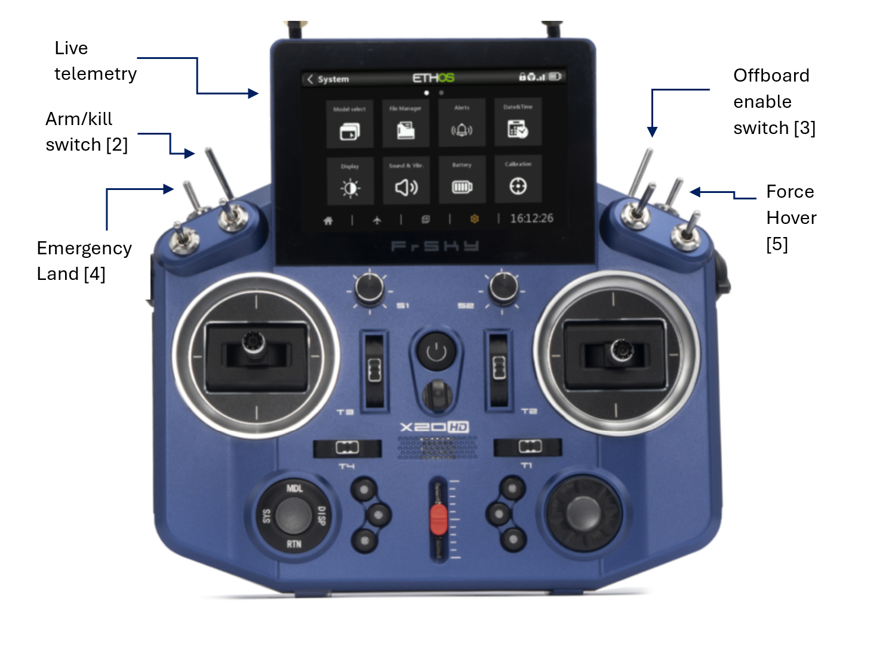

# Modes of Teleoperation

## Manual Control RC
This is used as the safety failsafe for the robot

## Manual Control UDP-Mavlink
The Px4 connects to Orin via secondary mavlink connection. This can be used to forward control signals via groundstation. USB joystick is used for manual control signal generation and the controls are forwarded via UDP

## ROS2 Velocity control

This can be used to forward control signals via groundstation through the primary DDS link. USB joystick is used for manual control signal generation