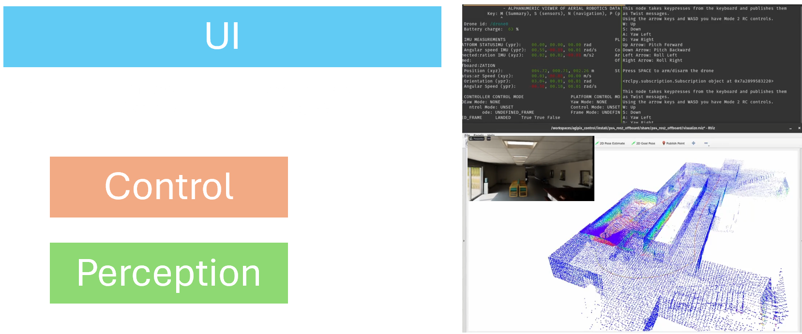

# Agipix (UI) — Quick Guide

Use this page to jump into the operator UI workflows. It’s brief and links to the detailed pages.

## Teleoperation

- Safety RC as a manual failsafe (primary manual mode).
- Manual control via UDP‑MAVLink from ground station with USB joystick.
- ROS 2 velocity teleop over DDS with joystick input.

## Exploration UI

- Visualize robot and live point cloud/map during exploration.
- Provide task context to the operator (state, progress, goals).
- Simple controls for starting/pausing missions and monitoring safety.

## Human‑in‑the‑Loop Autonomy

- High‑level intent converted to trajectories (e.g., waypoints, regions of interest).
- Explainable UI overlays: what the robot is doing and why.
- Smooth handoff between autonomy and manual intervention.

---

Related:
- Simulation quick guide: ../sim/[index](../sim/index.md)
- Autonomy quick guide: ../autonomy/[index](../autonomy/index.md)
