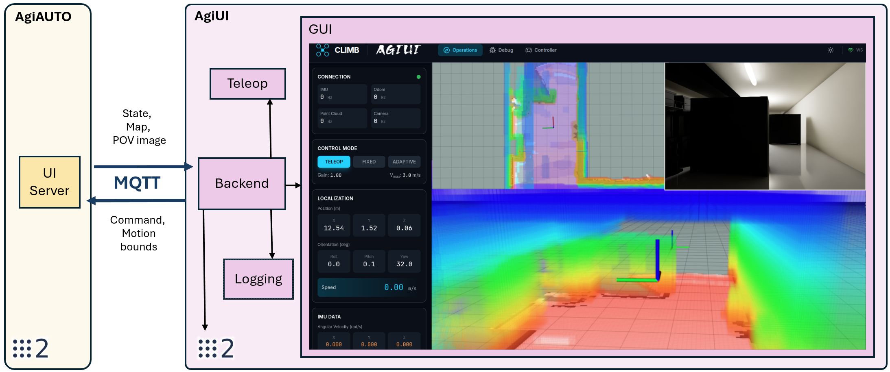

# Agipix (UI) — Quick Guide

Use this page to navigate AgiUI workflows for teleoperation, supervision, and autonomy handover.

## Teleoperation

- Safety RC as manual failsafe.
- Joystick and remote command pathways for direct robot control.
- Real-time state feedback for safe intervention.

Read: [Teleoperation](./1_teleoperation.md)

## Exploration UI

- Shared map and mission context visualization.
- Progress and status feedback during exploration tasks.
- Start/pause supervision actions for field use.

Read: [Exploration Autonomy](./2_exploration_autonomy.md)

## Human‑in‑the‑Loop Autonomy

- High-level task specification with autonomy-level switching.
- Operator-in-the-loop supervision and intervention.
- Continuous state and map feedback for trust and safety.

Read: [Human in the Loop Autonomy](./3_humen_in_the_loop_autonomy.md)

---

Related:
- [Simulation quick guide](../sim/index.md)
- [Autonomy quick guide](../autonomy/index.md)
- [Real platform quick guide](../real/index.md)
